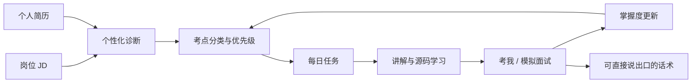

# OpenJob

**不是题库，是围绕一场具体面试持续推进的备考 Agent。**

输入岗位 JD、个人简历、面试日期和每天可投入的时间，OpenJob 会找出最该准备的考点，排成每天可以完成的任务，再通过讲解、源码、口述练习和模拟面试检验掌握度。

[下载最新版本](https://github.com/ivanzwb/openjob/releases) · [设计文档](docs/DESIGN.md) · [Apache License 2.0](LICENSE)


## 为什么做 OpenJob

面试前真正稀缺的通常不是资料，而是取舍：

- 同一份 JD，哪些内容最可能追问到你？
- 简历里写过的技术，哪些是必须讲透的雷区？
- 距离面试只剩几天，有限时间应该花在哪里？
- 看懂知识和源码后，怎样练到面试时能说出口？

OpenJob 不把知识图谱、题库、笔记和源码问答并排放着等你自己选择，而是把它们串成一条持续运行的备考链路：



## 核心能力

### 1. JD × 简历：判断“你会被问什么”

OpenJob 交叉分析目标岗位和个人经历，把考点分成四类：

- **必深挖**：JD 要求、简历也写过，需要准备原理、实现和取舍；
- **短板**：JD 要求、简历没有，优先建立可靠的答题框架；
- **雷区**：简历写过但可能讲不清，避免被顺手追问击穿；
- **加分项**：岗位相关但优先级较低，有余力再准备。


### 2. 根据面试日期安排每日任务

系统综合 JD 权重、简历匹配、考点难度、预计耗时、前置关系和当前掌握度，混合安排新学、复习、口述、源码阅读和兜底话术。当天无法完成的任务可以顺延，不必让整份计划失真。


### 3. 从“看懂”练到“能说出口”

知识点支持分层讲解、高亮、笔记和继续追问。“考我”会围绕当前考点出题，接受文字或语音作答，并给出评分、遗漏点与改进建议。作答结果会回写掌握度，继续影响后续计划。


### 4. 源码结论可以回到真实代码核对

桌面端可克隆并索引代码仓库。源码 Agent 通过目录、文件、符号、内容搜索和文件读取完成分析，并用 `file:line` 引用标注代码依据，避免把无法验证的模型输出直接背进面试。


### 5. 桌面做重任务，手机随时推进

桌面端负责完整诊断、规划、仓库克隆与索引；手机通过局域网扫码配对，同步备考数据、讲解、题目、计划和源码快照。已同步内容可以离线浏览和学习；调用云端 LLM 时仍需要网络，但不要求电脑保持在线。

<p align="center">
  
</p>

## 它和直接问大模型有什么不同

普通对话通常是一次性的：问一道题，得到一个答案，关闭窗口后不会改变明天的学习安排。

OpenJob 把模型放进一套有状态的流程：JD 和简历决定考点，面试日期决定取舍，作答修正掌握度，掌握度影响后续任务，最终内容沉淀为自己的面试话术。模型负责理解与生成，系统负责上下文、事实来源、优先级和闭环。

## 适合谁

- 距离面试只剩几天或几周，需要迅速做取舍；
- 收藏了大量资料，但每天不知道从哪里开始；
- 简历技术点较多，担心被连续深挖；
- 正在准备开发、架构、数据或算法等技术岗位；
- 希望通过口述和模拟面试训练输出，而不只是继续阅读；
- 希望在桌面与手机之间延续同一套备考进度。

如果只想临时查询一个定义，通用大模型通常更快；OpenJob 更适合需要围绕一次真实面试持续规划、学习和复盘的场景。

## 功能矩阵

| 能力 | 桌面端 | 手机端 |
|------|--------|--------|
| JD × 简历诊断与考点树 | ✅ | ✅（同步后浏览与学习） |
| 目标岗位库、简历定向优化与 PDF 导出 | ✅ | ✅（编辑、分块优化、导出 PDF） |
| 每日计划与任务推进 | ✅ | ✅ |
| 知识点讲解、考我、模拟面试 | ✅ | ✅ |
| 仓库克隆与 tree-sitter 索引 | ✅ | — |
| 源码 Agent 与 `file:line` 引用 | ✅ | ✅（同步源码快照后） |
| 联网检索（博查 / Tavily） | ✅ | 按配置 |
| 多端 P2P 同步 | ✅ | ✅ |
| 浅色 / 深色主题 | ✅ | ✅ |

## 技术栈

- **桌面**：Electron 43 + electron-vite + React 19 + Tailwind CSS 4
- **手机**：Expo 57 + React Native + expo-sqlite
- **数据**：SQLite + Drizzle ORM，变更日志驱动的端间同步
- **LLM**：OpenAI 兼容 API，多角色 / 多档位配置
- **代码理解**：web-tree-sitter、simple-git、Agent 工具箱

## 环境要求

- **Node.js** 22+
- **pnpm** 10+
- **Git**（仓库克隆功能）
- **Windows 打包**：Visual Studio 2022 构建工具（`better-sqlite3` 重编译）
- **手机开发**：Expo Go 或 Android / iOS 模拟器

国内网络建议设置镜像（构建 Electron 二进制时）：

```bash
export ELECTRON_MIRROR=https://npmmirror.com/mirrors/electron/
export ELECTRON_BUILDER_BINARIES_MIRROR=https://npmmirror.com/mirrors/electron-builder-binaries/
```

## 快速开始

### 桌面端

```bash
pnpm install
node node_modules/electron/install.js   # 首次若 electron/dist 不存在
pnpm dev
```

首次运行后在 **设置** 中配置 LLM Provider 与 API Key（密钥经系统 safeStorage 加密落盘）。

### 手机端

```bash
cd mobile
npm install
npm run db:bundle    # 从桌面端迁移打包 SQLite schema
npm start
```

在桌面 **设置 → 同步** 生成配对二维码，手机 **同步** 页扫码配对后点同步即可。同步只有一个入口：全表对账还是增量由程序自己判定，两边改到同一处时按修改时间取新的那份，写库前自动备份可回退。

### 常用脚本

| 命令 | 说明 |
|------|------|
| `pnpm dev` | 桌面开发模式 |
| `pnpm build` | 桌面生产构建 |
| `pnpm dist` | 打安装包（`dist/OpenJob-Setup-*.exe` 等） |
| `pnpm ci` | 类型检查 + lint + smoke + build |
| `pnpm db:generate` | 生成 Drizzle 迁移 |

## 安装包与发布

- 推送 `v*` tag 触发 [GitHub Actions](.github/workflows/release.yml) 构建并发布到 GitHub Release。
- Windows 安装包当前**未做 Authenticode 签名**，SmartScreen 可能提示不可信发布者 → 点「更多信息」→「仍要运行」，或右键安装包 → 属性 → 解除锁定。
- macOS 使用 ad-hoc 签名；首次打开可能提示未识别开发者，可在系统设置中允许。

## 同步说明

- 业务表、`app_setting`（配置与密钥）、仓库元数据与 `repo_file` 源码快照参与同步。
- 界面主题属于配置的一部分：默认浅色，在桌面端选定后随 `app_setting` 下发，手机端跟随，不单独设开关。已显式选过深色的配置不会被默认值覆盖。
- `repo_file` 体积大、**优先级最低**：同步前检查手机可用存储，空间不足时跳过源码快照并在同步页提示。
- 搜索缓存、仓库本机路径（`local_path`）各端独立，不同步。

详见 [设计文档 §5.7](docs/DESIGN.md#57-桌面--手机同步)。

## 项目结构

```
openJob/
├── src/
│   ├── main/          # Electron 主进程（DB、LLM、同步、Agent）
│   ├── renderer/      # React UI
│   ├── preload/       # IPC 白名单桥接
│   └── shared/        # 双端共享类型与协议
├── mobile/            # Expo 手机端
├── docs/DESIGN.md     # 产品与架构设计（主文档）
├── scripts/           # 构建、图标、NSIS 工具链等
└── electron-builder.yml
```

## 配置与密钥

运行时配置与密钥落在用户数据目录，**勿将 `config.json` / `secrets.json` 提交到仓库**（已在 `.gitignore` 中排除）。

## 文档

- [docs/DESIGN.md](docs/DESIGN.md) — 产品定位、数据模型、Agent 流程、同步协议、实施阶段与踩坑记录
- [OpenJob 产品长文](docs/marketing/openjob-longform.md) — 功能逻辑、使用价值与完整产品截图

## 许可证

本项目采用 [Apache License 2.0](LICENSE)。

## 作者

OpenJob — [ivan.zwb@gmail.com](mailto:ivan.zwb@gmail.com)
