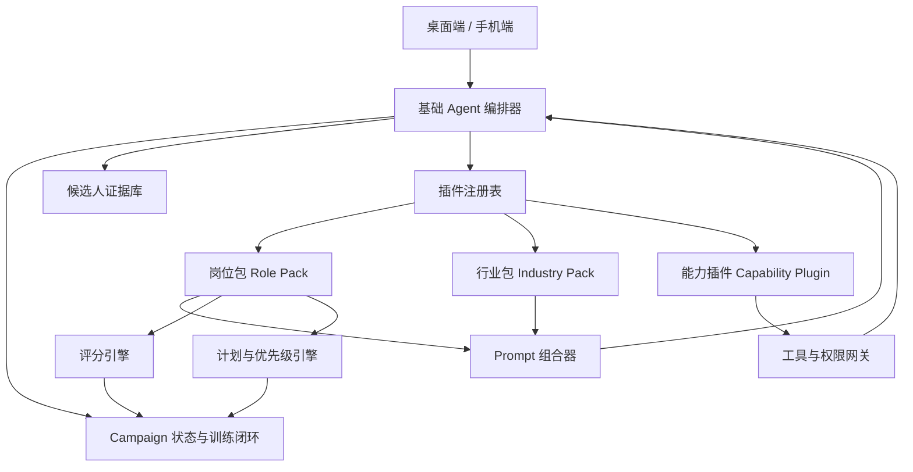
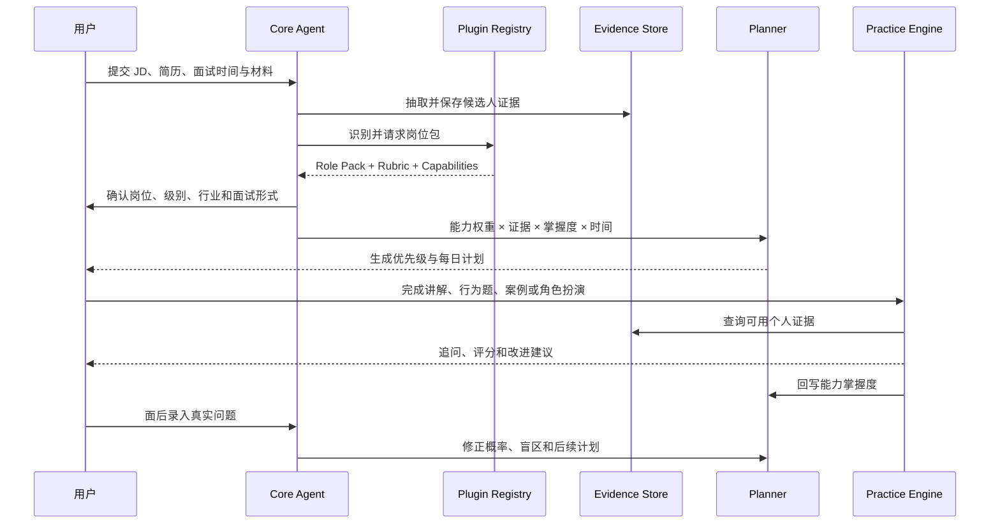

# OpenJob 通用面试 Agent 插件化架构

> 状态：Draft  
> 目标：将当前偏软件开发岗位的 OpenJob，演进为“通用基础 Agent + 岗位包 + 能力插件”的多职业面试准备平台。  
> 适用范围：桌面端、手机端、共享数据模型、Prompt、Agent 编排与插件扩展机制。  
> 本文描述目标架构，不表示相关接口已经实现。

---

## 1. 背景

OpenJob 当前已经具备一条完整的有状态备考链路：

```text
岗位 JD + 简历 + 面试日期
  → JD × 简历诊断
  → 知识点树与优先级
  → 每日计划
  → 讲解 / 考我 / 模拟面试
  → 掌握度更新
  → 面后复盘与真题回流
```

这条链路本身并不只适用于软件开发岗位。Campaign、覆盖类型、优先级、计划、讲解、练习、评分、话术和复盘都可以复用于其他职业。

当前限制主要来自领域假设被直接写进核心模型：

- `ExamForm` 固定为概念、编码、系统设计、场景；
- `TaskKind` 包含 `readCode`，排程会根据仓库存在自动插入源码任务；
- `ResumeParsed` 主要抽取技能、项目和技术深挖点；
- 公司情报以 `techStackMd` 为核心字段；
- 诊断、讲解和模拟面试 Prompt 大量使用技术、API、底层机制、代码和系统设计语义；
- 源码仓库与 `codeAgent` 被当成核心功能，而不是特定岗位能力。

如果仅通过放宽 Prompt 来支持更多岗位，会产生三个问题：

1. 岗位越多，诊断和评分越泛化；
2. 核心代码持续增加岗位相关的条件分支；
3. 桌面端与手机端容易各自维护一套岗位逻辑。

因此需要把岗位差异从基础 Agent 中拆出，形成稳定内核与可组合扩展。

---

## 2. 架构决策

OpenJob 采用三层扩展模型：

1. **基础 Agent（Core Agent）**  
   负责所有岗位共有的事实、状态、计划、训练和反馈闭环。

2. **岗位包（Role Pack）**  
   以声明式配置描述岗位能力、面试形式、评分量规、Prompt 片段、任务模板和信息来源。

3. **能力插件（Capability Plugin）**  
   为需要专用工具或交互的能力提供受控的可执行扩展，例如源码分析、作品集评审、数据案例分析和角色扮演。

软件开发能力不再属于基础 Agent，而是作为内置 `software-engineering` 岗位包及 `source-repository` 能力插件存在。

---

## 3. 目标与非目标

### 3.1 目标

- 同一套基础闭环支持不同职业和级别；
- 新增岗位时尽量不修改核心业务代码；
- 岗位差异能够被测试、版本化和回溯；
- 所有个人化答案必须基于候选人的真实证据；
- 桌面端和手机端共享岗位定义、题型和评分标准；
- 能力插件按 Campaign 按需加载；
- 保持现有软件开发 Campaign 和数据兼容。

### 3.2 非目标

- 首期不开放任意第三方 JavaScript 插件执行；
- 不用一个无限扩张的 System Prompt 覆盖所有职业；
- 不在首个版本内覆盖所有职业；
- 不允许岗位包绕过事实校验、权限控制和同步协议；
- 不把基础 Agent 拆成大量彼此独立、无法共享状态的自治 Agent。

---

## 4. 总体架构



### 4.1 运行时组合

每个 Campaign 的运行配置由以下部分组成：

```text
基础 Agent
  + 通用面试能力基线
  + 1 个主岗位包
  + 0~1 个行业包
  + 0~N 个能力插件
  + 公司 / JD 动态上下文
  + 用户本次要求
```

示例：

```text
基础 Agent
  + 通用面试能力基线
  + product-manager
  + ecommerce
  + analytics-case
  + portfolio-review
```

---

## 5. 基础 Agent

基础 Agent 是稳定内核，只处理跨岗位共有的问题。

### 5.1 核心职责

#### 输入与事实

- 导入和解析简历、JD、面试日期；
- 管理作品、案例、证书、演示材料等候选人材料；
- 建立候选人证据库；
- 管理来源、可信度和原文定位；
- 禁止将 JD 要求或公司信息伪装成候选人经历。

#### 岗位建模

- 识别岗位族、职能、级别、行业和地区；
- 选择主岗位包和可选能力插件；
- 根据 JD 调整岗位包提供的默认能力权重；
- 生成本次 Campaign 的面试蓝图。

#### 诊断与计划

- 将岗位能力与候选人证据交叉分析；
- 继续使用 `deepDive / gap / landmine / extra` 覆盖类型；
- 综合面试概率、证据强度、掌握差距和剩余时间排序；
- 生成每日训练计划并根据练习结果动态调整。

#### 训练与反馈

- 统一管理题目、作答、追问、评分和复练；
- 支持文本、语音及插件提供的专用交互；
- 将评分结果回写能力掌握度；
- 将高价值答案沉淀为故事或话术；
- 面试后摄入真实问题并修正能力图谱。

### 5.2 不属于基础 Agent 的内容

以下内容必须由岗位包或能力插件提供：

- 某岗位有哪些能力；
- 某种面试题应该如何出题；
- 某岗位如何评分；
- 某行业优先相信哪些信息来源；
- 是否需要源码、作品集、表格、演示或角色扮演工具；
- 特定岗位的术语、知识模板和案例库。

---

## 6. 插件分类

### 6.1 岗位包 Role Pack

岗位包描述“这个岗位如何面试”，默认是声明式数据，不执行任意代码。

岗位包包括：

- 适用岗位和级别；
- 能力模型及默认权重；
- 常见面试阶段；
- 支持的面试形式；
- 评分量规；
- 诊断、讲解、出题和评分 Prompt 片段；
- 任务模板；
- 信息来源和可信度策略；
- 依赖的能力插件；
- 兼容的基础 Agent 版本。

示例岗位包：

- `software-engineering`
- `data-analytics`
- `product-manager`
- `sales-customer-success`
- `operations-marketing`
- `finance`
- `human-resources`

### 6.2 行业包 Industry Pack

行业包描述“相同岗位在这个行业有什么不同”，不能独立替代主岗位包。

例如：

- `ecommerce`
- `fintech`
- `healthcare`
- `enterprise-software`
- `manufacturing`

行业包可以覆盖：

- 行业术语；
- 监管与风险要求；
- 常见业务指标；
- 案例背景；
- 信息来源；
- 少量能力权重。

行业包不能删除主岗位包的核心能力，也不能修改基础安全规则。

### 6.3 能力插件 Capability Plugin

能力插件处理声明式配置无法完成的专用工具、数据处理或交互。

首批内置插件可以包括：

| 插件 | 功能 | 适用岗位 |
|---|---|---|
| `source-repository` | Git 仓库、符号索引、源码问答和引用 | 软件、数据、算法 |
| `portfolio-review` | 作品集结构、叙事和展示评审 | 设计、产品、市场 |
| `analytics-case` | CSV/XLSX 数据分析与案例作答 | 数据、产品、运营、咨询 |
| `role-play` | 客户、面试官、利益相关者角色扮演 | 销售、客户成功、管理 |
| `presentation-review` | 演示结构、内容和表达反馈 | 产品、咨询、管理 |
| `document-corpus` | 案例包、SOP、行业材料的摄入与检索 | 通用 |

---

## 7. 插件协议

以下接口为目标设计，用于明确边界，不代表最终命名。

### 7.1 Manifest

```ts
interface PluginManifest {
  id: string;
  version: string;
  type: 'role-pack' | 'industry-pack' | 'capability';
  displayName: string;
  description: string;
  compatibility: {
    core: string;
    schema: number;
  };
  permissions: PluginPermission[];
  runtime?: {
    desktop: 'full' | 'view-only' | 'unsupported';
    mobile: 'full' | 'view-only' | 'unsupported';
  };
  artifactSchemas?: Record<string, number>;
  dependencies?: Array<{
    id: string;
    version: string;
    optional?: boolean;
  }>;
}
```

插件 ID 一旦发布不可修改。显示名称可以本地化，持久化和同步只使用 ID。

### 7.2 Role Pack

```ts
interface RolePack {
  manifest: PluginManifest;
  roleMatchers: RoleMatcher[];
  competencyTemplates: CompetencyTemplate[];
  interviewStages: InterviewStageTemplate[];
  interviewFormats: InterviewFormatDefinition[];
  rubrics: RubricDefinition[];
  taskTemplates: TaskTemplate[];
  promptFragments: PromptFragmentSet;
  sourcePolicy: SourcePolicy;
}
```

必需和可选能力统一通过 `manifest.dependencies` 表达，避免同时维护两套依赖来源。Role Pack 本身的 `permissions` 必须为空。

### 7.3 能力定义

```ts
interface CompetencyTemplate {
  id: string;
  name: string;
  category: 'knowledge' | 'skill' | 'behavior' | 'experience';
  description: string;
  defaultWeight: number;
  levelIndicators: Array<{
    level: number;
    behavior: string;
  }>;
  evidenceKinds: string[];
  supportedFormats: string[];
}
```

能力使用岗位包内稳定 ID，不使用名称作为关联键。名称可以变化，历史评分仍应关联同一能力。

### 7.4 面试形式

```ts
interface InterviewFormatDefinition {
  id: string;
  label: string;
  protocol:
    | 'knowledge'
    | 'behavioral'
    | 'case'
    | 'role-play'
    | 'work-sample'
    | 'presentation'
    | 'portfolio'
    | 'coding';
  defaultDurationMinutes: number;
  followUpPolicy: {
    maxRounds: number;
    strategy: 'fixed' | 'adaptive';
  };
  rubricId: string;
  capabilityId?: string;
}
```

`protocol` 描述交互方式；岗位包中的 `id` 描述具体题型。产品经理案例和咨询案例可以共享 `case` 协议，但使用不同 Prompt 与 Rubric。

### 7.5 评分量规

```ts
interface RubricDefinition {
  id: string;
  dimensions: Array<{
    id: string;
    label: string;
    weight: number;
    anchors: Record<1 | 2 | 3 | 4 | 5, string>;
    critical?: boolean;
  }>;
  passThreshold?: number;
  failConditions?: string[];
}
```

Rubric 必须给出各分数等级的可观察行为，不能只写“沟通能力”“专业性”等模糊名称。

### 7.6 能力插件

```ts
interface CapabilityPlugin {
  manifest: PluginManifest;
  register(registry: CapabilityRegistry): void;
}

interface CapabilityRegistry {
  registerTool(tool: ScopedToolDefinition): void;
  registerArtifactParser(parser: ArtifactParser): void;
  registerInteractionType(type: HostRenderedInteraction): void;
}
```

首期交互由宿主根据声明式 `HostRenderedInteraction` 渲染，不允许插件注入任意 React 组件。插件只能通过注册表贡献能力，不能直接访问数据库、密钥、同步服务或任意 IPC。

---

## 8. 插件组合与冲突规则

### 8.1 覆盖优先级

配置按以下顺序合并，后者只能覆盖允许覆盖的字段：

```text
基础默认值
  < 主岗位包
  < 行业包
  < 公司 / JD 动态分析
  < 用户本次明确要求
```

安全规则、事实来源规则和插件权限不参与覆盖。

### 8.2 主岗位包

每个 Campaign 必须且只能选择一个主岗位包。行业包与能力插件均为可选。

当自动识别结果置信度不足时，应让用户确认，不允许同时加载多个主岗位包并把所有题型混在一起。

“通用面试能力基线”属于基础 Agent，不是 Role Pack。它提供自我介绍、简历深挖、行为题、求职动机和反问等跨岗位能力。因此产品经理 Campaign 仍然只加载一个 `product-manager` 主岗位包。

### 8.3 冲突处理

- 相同能力 ID：行业包只能调整权重和补充说明；
- 相同面试形式 ID：禁止重复注册；
- 相同工具名：禁止覆盖；
- 缺少必需能力插件：岗位包不可启用；
- 插件版本不兼容：Campaign 保留原版本，只提示迁移；
- 多个插件请求同一 UI Slot：按主岗位包声明顺序排列，不允许互相替换。

### 8.4 按需加载

插件加载由当前 Campaign 决定。

非工程 Campaign：

- 不加载代码工具定义；
- 不加载 Repo Map；
- 不显示源码入口；
- 排程不生成 `readCode`；
- Prompt 不出现代码、API 或系统设计要求。

### 8.5 确定性加载流程

桌面端和手机端不能各自推断插件组合。Campaign 创建或迁移时，由共享 resolver 生成并持久化 `CampaignRuntimeDescriptor`：

```ts
interface CampaignRuntimeDescriptor {
  campaignId: string;
  coreVersion: string;
  rolePack: ResolvedPluginRef;
  industryPack?: ResolvedPluginRef;
  capabilities: Array<ResolvedPluginRef & {
    enabled: boolean;
    disabledReason?: string;
  }>;
  competencyBaselineVersion: string;
  configSnapshotHash: string;
  resolvedAt: number;
}
```

Resolver 必须按固定顺序执行：

1. 从内置或受信目录发现插件；
2. 校验来源、Manifest、Core 与 schema 兼容范围；
3. 选择 Campaign 固定的精确版本；
4. 展开依赖并检测缺失、循环和版本冲突；
5. 校验插件声明的各客户端运行能力与 artifact schema；
6. 在内存中完成全部注册和 Contract 校验；
7. 只有全部必需项成功后，原子写入 descriptor 并激活。

可选依赖不可用时记录 `disabledReason` 后继续；必需依赖不可用时保持上一个有效 descriptor，不允许部分激活。安装插件不等于为 Campaign 启用插件。

Phase 0 的插件全部随应用发布，通过内置插件 ID 白名单和构建产物哈希校验来源，不要求独立签名。签名只适用于后续可导入插件。兼容范围和依赖范围使用 SemVer；新 Campaign 从已安装且满足范围的版本中选择最高版本，激活后在 binding 中固定为精确版本。

Resolver 生成的是客户端无关 descriptor，不因当前在桌面或手机运行而改变绑定。客户端再根据 Manifest 的 `runtime` 字段和本地版本计算本机视图与降级状态。

### 8.6 失败与降级

- 注册失败：整次激活回滚，不保留部分注册结果；
- 工具超时或插件崩溃：取消本次调用，保留 Campaign 状态并记录审计日志；
- 连续失败：对当前 Campaign 暂停该插件，允许用户重试或恢复；
- 固定版本不可用：历史结果仍可查看，新的插件任务停止执行并显示原因；
- 当前客户端不支持：Planner 在生成计划时改排等价宿主任務；没有替代项时标记为“需桌面完成”，不能显示为普通可执行任务；
- 未知 artifact schema：只保留下载/同步，不尝试解析；
- 权限撤销：立即终止后续调用，不删除已经生成的历史结果。

---

## 9. Prompt 架构

插件化不能退化为字符串任意拼接。Prompt 应由固定层次组成：

```text
Core Policy
  + Agent Stage Policy
  + Role Pack Fragment
  + Industry Fragment
  + Interview Format Protocol
  + Rubric
  + Candidate Evidence
  + Job / Company Context
  + User Request
```

### 9.1 Core Policy

由基础 Agent 独占，插件不可覆盖：

- 事实忠实；
- 个人经历必须来自候选人证据；
- JD 和公司信息不能当作候选人经历；
- 输出结构约束；
- 工具权限；
- 隐私与安全；
- 引用要求。

### 9.2 Prompt Fragment

岗位包只能向预定义 Slot 提供片段：

```ts
interface PromptFragmentSet {
  diagnosis?: string;
  explanation?: string;
  questionGeneration?: Record<string, string>;
  scoring?: Record<string, string>;
  answerCoaching?: Record<string, string>;
  debrief?: string;
}
```

岗位包不能提供完整 System Prompt，以避免覆盖基础约束。

Prompt Fragment 还必须通过静态规则检查，禁止声明角色重置、权限提升或绕过证据策略。静态检查不是唯一安全边界；所有模型调用仍必须经过 Core 的统一调用链。

### 9.3 Prompt 可追溯性

每次生成至少记录：

- Core 版本；
- Role Pack ID 与版本；
- Industry Pack ID 与版本；
- Capability Plugin 版本；
- Rubric ID；
- Prompt registry key；
- 模型与参数；
- 使用的证据 ID。

这样才能复现为什么某次评分或计划发生变化。

### 9.4 强制调用链

能力插件不能直接调用模型、网络工具或数据存储。所有请求都必须经过：

```text
插件请求
  → 权限网关
  → 当前 Campaign 的最小数据投影
  → Core Prompt 组合器
  → Model / Tool Gateway
  → 输出 Schema 校验
  → 候选人事实声明校验
  → 审计与提交
```

事实校验默认 fail closed：

- 无法关联 CandidateEvidence 的个人事实不提交；
- 可安全删除时删除无证据句并标记；
- 删除会改变回答含义时，最多重新生成一次；
- 仍不通过则返回明确错误，不把结果保存为话术或 Story。

插件只有读取已确认 Evidence 的能力；新 Evidence 只能作为 proposal 写入，必须经 Core 去重和用户确认后才能成为可信事实。

---

## 10. 数据模型

### 10.1 新增核心实体

#### RoleProfile

描述本次求职目标：

```ts
interface RoleProfile {
  id: string;
  roleFamily: string;
  rolePackId: string;
  level: string | null;
  industryPackId: string | null;
  location: string | null;
  interviewLanguage: string;
  confidence: number;
  userConfirmed: boolean;
}
```

`RoleProfile` 只保存用户的岗位选择意图，不保存执行版本。插件精确版本以当前激活的 `CampaignPluginBinding` revision 为唯一权威；`CampaignRuntimeDescriptor` 是该 revision 解析后的只读快照。

#### CandidateEvidence

候选人个人事实的唯一来源：

```ts
interface CandidateEvidence {
  id: string;
  resumeId: string | null;
  artifactId: string | null;
  kind: 'experience' | 'achievement' | 'skill' | 'behavior' | 'credential';
  title: string;
  statement: string;
  sourceText: string;
  sourceStart: number | null;
  sourceEnd: number | null;
  occurredAt: string | null;
  confidence: number;
  userConfirmed: boolean;
}
```

#### Competency

Campaign 中实际使用的岗位能力实例：

```ts
interface Competency {
  id: string;
  campaignId: string;
  templateId: string;
  rolePackId: string;
  name: string;
  category: string;
  weight: number;
  coverageType: CoverageType;
  mastery: number;
  evidenceStrength: number;
  priorityScore: number;
}
```

#### CompetencyEvidence

连接能力和候选人证据：

```ts
interface CompetencyEvidence {
  competencyId: string;
  evidenceId: string;
  relevance: number;
  rationale: string;
}
```

#### Story

将候选人的真实经历整理为可复用口述故事：

```ts
interface Story {
  id: string;
  campaignId: string;
  title: string;
  situationMd: string;
  taskMd: string;
  actionMd: string;
  resultMd: string;
  reflectionMd: string;
  evidenceIds: string[];
  competencyIds: string[];
}
```

Story 可以有 30 秒、60 秒、2 分钟等多个口述版本，但所有版本共享同一组事实证据。

#### PracticeAttempt

统一替代题型各自存储结果的趋势：

```ts
interface PracticeAttempt {
  id: string;
  campaignId: string;
  formatId: string;
  competencyIds: string[];
  questionMd: string;
  answerMd: string;
  transcriptMd: string | null;
  rubricId: string;
  dimensionScores: Record<string, number>;
  totalScore: number;
  feedbackMd: string;
  previousAttemptId: string | null;
  createdAt: number;
}
```

### 10.2 现有实体映射

| 现有实体/字段 | 目标处理 |
|---|---|
| `Campaign` | 继续作为中心对象，新增 `roleProfileId` |
| `KnowledgeNode` | 表名暂不修改，语义逐步升级为 Competency |
| `CoverageType` | 保留，解释从“技能覆盖”扩展为“能力证据覆盖” |
| `ExamForm` | 旧值保留；新逻辑从岗位包的 InterviewFormat registry 读取 |
| `DesignCase` | 短期兼容；长期迁移为通用 PracticeAttempt |
| `ResumeParsed.skills` | 兼容保留，新增 experiences/evidence/credentials 等结构 |
| `CompanyIntel.techStackMd` | 双读迁移到 `roleSignalsMd` 或结构化 sections |
| `TaskKind.readCode` | 保留旧值，由工程岗位包启用 |
| `Repo / CodeRef` | 下沉为 `source-repository` 插件私有数据 |
| `SpeechSnippet` | 保留，可关联 Story、PracticeAttempt 和 Competency |

---

## 11. Agent 运行流程



### 11.1 Intake

1. 解析 JD 和简历；
2. 识别岗位族、职级和行业；
3. 抽取候选人证据；
4. 选择岗位包；
5. 提示用户确认自动识别结果；
6. 根据材料启用可选能力插件。

### 11.2 Diagnose

1. 从岗位包实例化能力模板；
2. 用 JD 调整能力权重；
3. 将候选人证据映射到能力；
4. 计算覆盖类型和证据强度；
5. 结合面经和公司信息修正考察概率；
6. 生成面试阶段蓝图。

### 11.3 Plan

优先级建议扩展为：

```text
priority =
  interviewProbability
  × masteryGap
  × evidenceRisk
  × stageWeight
  × coverageBoost
  ÷ preparationCost
```

其中：

- `evidenceRisk`：简历声称很强但证据薄弱时提高；
- `stageWeight`：即将到来的面试轮次权重更高；
- `preparationCost`：避免低收益任务占满计划。

### 11.4 Practice

基础 Agent 选择 `InterviewFormat`，再由协议驱动交互：

- `knowledge`：问答与概念追问；
- `behavioral`：围绕能力和 Story 多轮追问；
- `case`：澄清、分析、建议和复盘；
- `role-play`：保持角色状态并根据用户回应推进；
- `work-sample`：处理实际材料并提交产物；
- `presentation`：限时陈述与问答；
- `portfolio`：作品选择、叙事和决策追问；
- `coding`：工程岗位专用。

### 11.5 Evaluate

评分必须输出：

- 每个 Rubric dimension 的分数；
- 对应等级锚点；
- 引用用户回答中的证据；
- 关键缺失；
- 一次可执行的改进动作；
- 是否需要复练；
- 更新后的能力掌握度。

### 11.6 Debrief

面后复盘是通用 Agent 的核心闭环，手机端必须支持：

- 快速录入真实问题；
- 语音转写；
- 标记面试轮次和面试官类型；
- 关联能力和 Story；
- 记录实际表现；
- 识别能力图谱盲区；
- 更新后续 Campaign 的先验。

---

## 12. UI 扩展机制

### 12.1 固定主导航

插件不能任意创建一级导航。建议保持稳定信息架构：

- 总览；
- 简历与证据；
- 备考 Campaign；
- 模拟面试；
- 话术与故事；
- 资料；
- 设置。

工程岗位的“源码”可以显示为能力插件入口；未启用时隐藏。

### 12.2 UI Slots

能力插件只能注册到有限 Slot：

```ts
type PluginUiSlot =
  | 'campaign.materials'
  | 'campaign.study'
  | 'campaign.practice'
  | 'practice.input'
  | 'practice.result'
  | 'artifact.preview'
  | 'settings.plugin';
```

插件 UI 必须复用宿主主题、弹窗、任务状态和错误处理，不自行创建全局状态体系。

### 12.3 双端能力协商

每个能力插件声明运行位置：

```ts
type RuntimeAvailability = {
  desktop: 'full' | 'view-only' | 'unsupported';
  mobile: 'full' | 'view-only' | 'unsupported';
};
```

该声明实际存放在 Capability Plugin 的 Manifest 中；此处类型仅说明其语义。

例如源码仓库：

- 桌面端：克隆、索引、更新、问答；
- 手机端：读取已同步快照、问答；
- 同步：只同步数据和插件版本引用，不同步可执行插件代码。

两端消费同一份 `CampaignRuntimeDescriptor`。当本机能力低于 descriptor 要求时，只做本地降级，不重新解析依赖或改变 Campaign 绑定。离线状态下只能执行 Manifest 明确支持且所需 artifact schema 已缓存的任务。

---

## 13. 安全与权限

### 13.1 插件权限

```ts
type PluginPermission =
  | 'evidence:read-confirmed'
  | 'evidence:propose'
  | 'artifact:read'
  | 'artifact:write'
  | 'network:search'
  | 'network:fetch'
  | 'llm:complete'
  | 'filesystem:workspace'
  | 'repository:read'
  | 'microphone:read';
```

默认拒绝所有权限。岗位包不应拥有可执行权限；能力插件按功能申请最小权限。

`llm:complete` 仅代表“可向统一 Model Gateway 请求一次模型调用”，不提供 SDK、密钥或绕过 Core Prompt 组合器的能力。

### 13.2 数据访问

插件不能直接获得数据库连接，只能调用受控服务：

```ts
interface PluginServices {
  evidence: EvidenceService;
  artifacts: ArtifactService;
  practice: PracticeService;
  tools: ToolGateway;
  logger: PluginLogger;
}
```

服务层负责 Campaign 隔离、权限检查、审计和同步事件。

### 13.3 外部插件策略

建议分阶段开放：

1. 首期仅支持仓库内置岗位包和能力插件；
2. 第二阶段允许导入声明式岗位包；
3. 第三阶段支持签名、来源可信的能力插件；
4. 在具备沙箱、权限提示、撤销和审计前，不加载任意本地脚本。

---

## 14. 版本与迁移

### 14.1 版本记录

Campaign 的每次运行配置修订必须固定插件精确版本，避免插件升级后历史结果无法解释。

```ts
interface CampaignPluginBinding {
  campaignId: string;
  pluginId: string;
  pluginVersion: string;
  configJson: unknown;
  configSnapshotHash: string;
  revision: number;
  activeExecution: boolean;
  enabledAt: number;
}
```

历史结果同时保存当时的 Manifest、Prompt fragment、Rubric 和配置快照。可执行代码不复制进数据库；旧执行版本不可用时只能查看历史结果，不能静默改用新版本重跑。

### 14.2 升级策略

- Patch：可以自动提出升级，但仍创建新的 binding revision 和 descriptor；
- Minor：新增能力或 Rubric，需重新计算受影响内容；
- Major：能力 ID、题型协议或数据结构变化，必须显式迁移；
- 历史 PracticeAttempt 不重算，只记录当时版本；
- 未迁移的 Campaign 继续使用原 binding；若执行版本已不可用，则进入只读降级。

### 14.3 旧数据迁移

第一阶段采用增量迁移，不直接重命名或删除旧表：

1. 内置 `software-engineering` 岗位包；
2. 为所有旧 Campaign 绑定该岗位包；
3. 将旧 `ExamForm` 映射为岗位包题型；
4. 保留 `KnowledgeNode`、`DesignCase` 和 `readCode`；
5. 新功能写入新实体，同时兼容读取旧字段；
6. 桌面和手机都完成双读后，再考虑停止写旧字段。

迁移规则：

| 对象 | 新权威存储 | 迁移期读取顺序 | 写入策略 | 失败/回滚 |
|---|---|---|---|---|
| Campaign 岗位 | `RoleProfile` | 新值 → 默认工程岗位 | 新 Campaign 只写新值 | 删除未完成绑定，继续旧路径 |
| 题型 | `InterviewFormat.id` | 新 ID → `ExamForm` 映射 | 双写一个发布周期 | 未知 ID 按旧 ExamForm 执行 |
| 能力 | `Competency` | 新实体 → `KnowledgeNode` | 新流程写 Competency，适配层同步必要字段 | 保留 KnowledgeNode 为旧端权威 |
| 练习结果 | `PracticeAttempt` | 新实体 → Quiz/DesignCase | 新流程写新实体，旧 UI 经适配层读取 | 不删除旧结果 |

Backfill 必须可重复执行并记录 checkpoint。低于最小兼容版本的手机端只能读取已迁移 Campaign，不能写入插件化字段；同步协议应返回“需要升级”，而不是接受后造成数据回退。

旧 Campaign 的首次 backfill 在同一数据库事务中创建 `RoleProfile`、`CampaignPluginBinding` 和 `CampaignRuntimeDescriptor`，成功后才写入 checkpoint。任一步失败则整笔回滚，Campaign 继续走旧执行路径；再次启动时可以安全重试。

---

## 15. 首批岗位包

架构可以面向全岗位，但首发不应同时覆盖所有职业。

### 15.1 通用面试能力基线

该基线由 Core Agent 所有并随 Core 版本发布，不参与岗位包依赖解析。所有岗位默认包含：

- 自我介绍；
- 简历经历深挖；
- STAR/CAR 故事；
- 求职动机；
- 优势与短板；
- 冲突、失败、推动、学习等行为题；
- 公司与岗位匹配；
- 反问面试官。

### 15.2 software-engineering

- 技术知识问答；
- 编码和算法；
- 系统设计；
- 项目技术深挖；
- 源码仓库；
- 技术准确性、复杂度和权衡 Rubric。

### 15.3 product-manager

- 产品 Sense；
- 用户问题定义；
- 指标与数据分析；
- 优先级；
- 产品案例；
- 路线图；
- 跨团队推动；
- 产品决策和复盘 Rubric。

### 15.4 sales-customer-success

- 客户发现；
- 价值表达；
- 异议处理；
- 方案陈述；
- 谈判；
- Pipeline 推进；
- 客户角色扮演；
- 应变、倾听和推进 Rubric。

首发选择这三个岗位包，是为了验证知识问答、案例分析和角色扮演三类不同交互，而不是因为它们可以代表全部职业。

### 15.5 新岗位包接入清单

以 `product-manager` 为例，作者必须完成：

1. 创建 Manifest，声明稳定 ID、版本和 Core/schema 兼容范围；
2. 添加 RoleMatcher，使用岗位标题和 JD 职责信号，不以公司名称判断；
3. 定义稳定能力 ID，例如 `pm.problem-framing`、`pm.metrics`、`pm.prioritization`；
4. 定义 `case`、`behavioral`、`presentation` 等 InterviewFormat；
5. 为每个 format 绑定包含 1–5 分行为锚点的 Rubric；
6. 仅向允许的 Prompt Slot 提供片段；
7. 将 `analytics-case`、`portfolio-review` 声明为可选依赖；
8. 添加 JD、简历、期望能力图谱和禁止技术污染的 Golden fixture；
9. 注册到 shared registry；
10. 通过 Contract、Golden 和跨端解析测试后才允许出现在 Campaign 选择器中。

新增此岗位包不应修改 Planner、Practice Engine、数据库访问层或 Core Prompt Policy。

---

## 16. 代码改造边界

### 16.1 Shared 优先

岗位定义、题型协议、Rubric 和 Prompt Slot 必须先进入 `src/shared`，然后由桌面端和手机端共同使用。

禁止：

- 桌面端和手机端分别维护岗位名称；
- 两端分别写 Prompt；
- 手机端自行推断插件能力；
- 通过 UI 文案判断插件类型。

### 16.2 第一批改造位置

| 代码区域 | 改造方向 |
|---|---|
| `src/shared/enums.ts` | 保留旧枚举，新增 registry ID 与通用协议类型 |
| `src/shared/entities.ts` | 新增 RoleProfile、CandidateEvidence、Competency、Story、PracticeAttempt |
| `src/shared/diagnosis/prompts.ts` | 从固定技能树改为岗位包提供能力模板 |
| `src/shared/design/prompts.ts` | 将题型和 Rubric 从硬编码常量迁出 |
| `src/shared/prompts/explain.ts` | 根据能力类别选择讲解结构，不再固定“代码/实例” |
| `src/shared/prompts/registry.ts` | 记录插件来源、版本和 Prompt Slot |
| `src/main/plan/schedule.ts` | `readCode` 改为岗位包声明的可选任务 |
| `src/shared/config.ts` | 搜索来源、可信度和时效支持岗位包覆盖 |
| `src/main/db/schema.ts` | 增量新增插件、证据、能力、故事和练习实体 |
| `src/shared/ipc.ts` | 新增插件查询、能力协商和通用 Practice contract |
| 桌面/手机 Campaign UI | 增加岗位、级别、行业和插件确认 |
| 手机端复盘 | 补齐面经摄入与面后复盘闭环 |

---

## 17. 分阶段实施

### Phase 0：兼容性抽象

- 建立插件 Manifest 与 registry；
- 建立最小权限网关、共享 resolver 和运行时能力协商；
- 新增 RoleProfile；
- 用适配层将现有软件开发逻辑登记为 `software-engineering` 岗位包；
- 将现有仓库能力登记为 `source-repository` 内置插件，代码暂留原位置，但所有入口先经过权限网关；
- 旧 Campaign 自动绑定工程岗位包；
- 核心路径仍保持原行为。

验收：

- 现有 Campaign 无需重新创建；
- 桌面和手机数据一致；
- 软件开发功能无回归。

### Phase 1：通用核心

- CandidateEvidence；
- 通用能力图谱；
- 通用面试能力基线；
- 行为面试协议；
- 最小可用的 `product-manager` 岗位包；
- Story 工作台；
- 结构化 Rubric；
- 手机端面后复盘。

验收：

- 非技术 JD 不再生成编码、源码或系统设计任务；
- 个人化答案可以回溯到证据；
- 产品岗位可走完诊断、计划、训练、评分和复盘。

### Phase 2：首批岗位包

- 完善 `product-manager`，新增 `sales-customer-success`；
- 去除 `software-engineering` 对旧逻辑的适配依赖；
- 将 `source-repository` 实现移出旧 Core 路径，保留 Phase 0 已建立的插件协议；
- 岗位化公司情报和搜索来源；
- Role Pack 管理界面。

验收：

- 不同岗位包生成明显不同的能力、题型、Rubric 和计划；
- 新岗位包无需修改 Core Agent；
- 禁用源码插件后不加载相关工具和上下文。

### Phase 3：能力插件

- 在 Phase 0 内置插件协议基础上扩展通用能力插件；
- `portfolio-review`；
- `analytics-case`；
- `role-play`；
- `presentation-review`；
- 插件超时、隔离、暂停和恢复机制。

验收：

- 插件只能通过授权服务访问数据；
- 插件不可绕过事实规则；
- 桌面和手机能够正确展示能力可用性。

### Phase 4：生态化

- 声明式岗位包导入；
- 插件签名和来源；
- 版本迁移；
- 组织自定义岗位包与 Rubric；
- 插件质量评估和回滚。

---

## 18. 测试策略

### 18.1 Contract Test

每个岗位包必须验证：

- Manifest 合法；
- ID 唯一；
- 依赖可解析；
- 权重合法；
- Rubric 权重总和正确；
- Rubric 每个等级存在锚点；
- InterviewFormat 引用的 Rubric 和 capability 存在；
- Prompt 只使用允许的 Slot。

### 18.2 Golden Test

每个岗位包维护一组固定 JD 和简历样本，验证：

- 识别出正确岗位族和级别；
- 能力图谱没有明显跨岗位污染；
- 非工程岗位不出现编码、源码和 QPS 等内容；
- 工程岗位继续生成原有能力；
- 评分维度符合岗位；
- 个人经历不被编造。

### 18.3 Cross-client Test

- shared registry 在桌面和手机解析结果一致；
- 插件版本同步一致；
- 手机不支持的能力正确显示为只读或不可用；
- 历史 Campaign 在两端都能打开；
- 面后复盘能从手机回流桌面。

### 18.4 Plugin Isolation Test

- 未声明权限的工具不可调用；
- 插件不能读取其他 Campaign；
- 插件异常不会破坏基础 Agent 状态；
- 插件卸载后历史结果仍可查看；
- 插件升级失败可回滚。

---

## 19. 产品指标

通用化不能只看支持了多少岗位，应关注：

- **事实忠实率**：个人经历是否都能回溯到 CandidateEvidence；
- **岗位特异性**：切换岗位包后能力、题型和 Rubric 是否显著变化；
- **闭环完成率**：是否完成诊断、练习、评分和复练；
- **复练改进幅度**：同一能力的后续 PracticeAttempt 是否提高；
- **计划命中率**：高优先级能力是否与真实面试问题重合；
- **盲区发现率**：面后复盘发现了多少预测外问题；
- **插件利用率**：启用的能力插件是否真正进入训练流程。

---

## 20. 风险与缓解

### 20.1 “通用”导致质量下降

风险：岗位包只换术语，没有真实能力模型和 Rubric。

缓解：

- 每个岗位包必须提供等级锚点；
- 维护岗位 Golden Test；
- 首发限制岗位数量；
- 引入真实面试复盘校准。

### 20.2 插件系统过早复杂化

风险：在产品需求未验证前投入动态加载、市场和沙箱。

缓解：

- 首期只做仓库内置插件；
- 岗位包先用静态 TypeScript/JSON；
- 等至少三个岗位包稳定后再开放外部扩展。

### 20.3 数据模型迁移破坏双端

风险：桌面升级后，手机无法识别新题型或插件。

缓解：

- schema version 和 plugin compatibility 双重检查；
- 只做增量字段和新表；
- shared contract 先行；
- 双读期覆盖至少一个发布周期。

### 20.4 Prompt 被插件覆盖

风险：岗位包破坏事实忠实和安全规则。

缓解：

- 插件只提供 Prompt Slot；
- Core Policy 永远在最高优先级；
- Prompt 组合结果进入日志；
- 对个人化输出执行证据校验。

### 20.5 任意代码插件带来安全问题

风险：读取密钥、文件或执行不受控网络请求。

缓解：

- 首期禁止外部可执行插件；
- 最小权限；
- 受控服务代理；
- 签名、审计、撤销和沙箱成熟后再开放。

---

## 21. 待确认问题

1. 首发第三个岗位包选择销售/客户成功，还是运营/市场？
2. 岗位包是否允许用户本地编辑，还是只允许复制为自定义包？
3. Industry Pack 首期是否必要，还是先仅保留字段？
4. PracticeAttempt 是否立即统一现有 QuizAttempt 和 DesignCase，还是先做适配层？
5. Role Pack 的发布和升级是否跟随应用版本，还是独立版本化？
6. 作品集、数据案例和演示评审首期需要支持哪些文件格式？
7. 语音训练首期只做转写和内容评分，还是同时评估语速、停顿和冗词？

---

## 22. 决策摘要

- OpenJob 保留 Campaign 驱动、计划驱动和掌握度反馈的核心产品形态；
- 通用化采用“基础 Agent + 岗位包 + 行业包 + 能力插件”；
- 岗位包优先声明式，能力插件才允许受控代码扩展；
- 软件开发变成一个内置岗位包，不再定义整个核心模型；
- 个人化回答统一建立在 CandidateEvidence 上；
- 岗位能力、题型、Rubric、Prompt 和来源策略全部版本化；
- shared contract 先于桌面和手机实现；
- 首期先验证通用核心、工程、产品和销售/客户成功，不追求一次覆盖所有职业；
- 外部可执行插件推迟到权限、沙箱、签名和回滚机制成熟之后。
