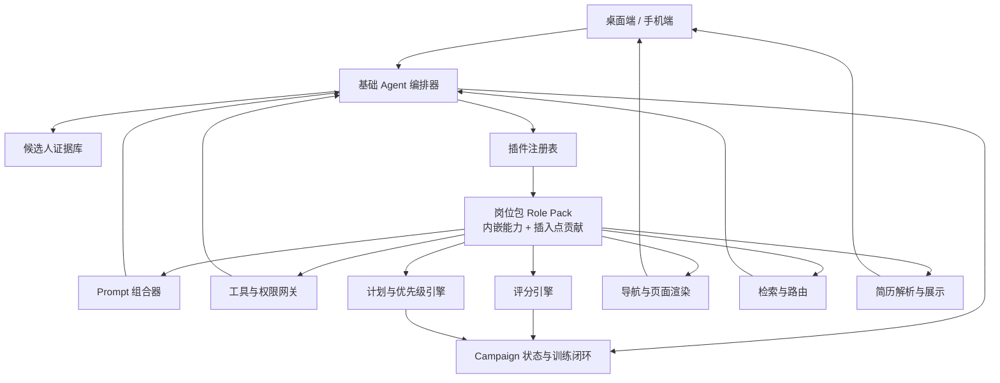
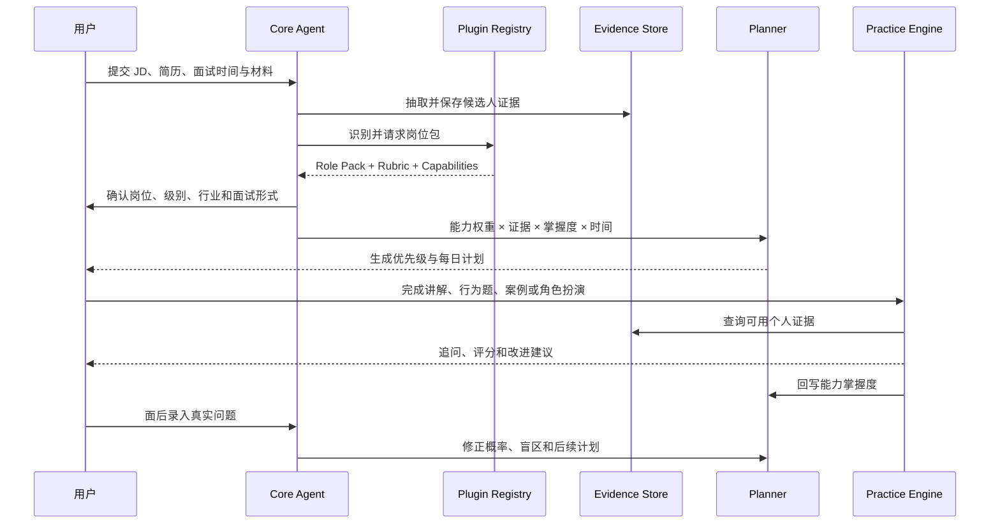

# OpenJob 通用面试 Agent 插件化架构

> 状态：Draft（v3：VSCode/Obsidian 式代码插件 + Webview 沙箱；v2 的两层模型与插入点仍有效，2026-09）  
> 目标：将当前偏软件开发岗位的 OpenJob，演进为“通用基础 Agent + 岗位包”的多职业面试准备平台。  
> 适用范围：桌面端、手机端、共享数据模型、Prompt、Agent 编排与插件扩展机制。  
> 本文负责架构决策与系统边界，不表示相关接口已经实现。任务依赖、接口所有权和并行开发安排见 [v1.0 实施计划](./GENERAL_INTERVIEW_AGENT_IMPLEMENTATION_PLAN.md)。

---

## 1. 背景

OpenJob 当前已经具备一条完整的有状态备考链路：

```text
岗位 JD + 简历 + 面试日期
  → JD × 简历诊断
  → 知识点树与优先级
  → 每日计划
  → 讲解 / 考我 / 模拟面试
  → 掌握度更新
  → 面后复盘与真题回流
```

这条链路本身并不只适用于软件开发岗位。Campaign、覆盖类型、优先级、计划、讲解、练习、评分、话术和复盘都可以复用于其他职业。

平台把领域假设收敛成岗位包的声明，基础包里只留不认岗位的机制：

- 题型是岗位包声明的词汇（`RolePack.examForms`）：`id` 写进 `knowledge_node.exam_forms`，宿主只当
  不透明字符串携带、按包查声明（见 7.2、7.8）；
- 任务种类是包声明的字符串（`TaskTemplate.taskKind`），宿主只认自己生成的那几种；带材料的任务由包的
  `materialKind` + `materialCollection` 声明，任务页由包页面承担（`view.pageId`）；
- 简历模块、公司情报字段，以及诊断 / 讲解 / 出题 / 评分 / 辅导的 Prompt 片段都随岗位包分发；
- 源码仓库与 `codeAgent` 随 `software-engineering` 岗位包的内嵌声明分发（能力与角色见 7.8、7.9）。

如果仅通过放宽 Prompt 来支持更多岗位，会产生三个问题：

1. 岗位越多，诊断和评分越泛化；
2. 核心代码持续增加岗位相关的条件分支；
3. 桌面端与手机端容易各自维护一套岗位逻辑。

因此需要把岗位差异从基础 Agent 中拆出，形成稳定内核与可组合扩展。

---

## 2. 架构决策

OpenJob 采用两层扩展模型：

1. **基础 Agent（Core Agent）**  
   负责所有岗位共有的事实、状态、计划、训练和反馈闭环。

2. **岗位包（Role Pack）**  
   以声明式配置描述一个岗位如何面试：能力模型、面试形式、评分量规、Prompt 片段、任务模板和信息来源，并**内嵌该岗位需要的全部能力扩展**（工具、交互、文件解析及其实现），以及**全部插入点贡献**（导航入口、检索策略、简历模块）。

插件分三类，但只有岗位包是岗位定义的载体：

- **岗位包（role-pack）**：一个岗位族的全部声明与实现。能力扩展（如源码分析、角色扮演、数据案例）内嵌在岗位包中，随包一起声明、校验、版本化和分发；
- **能力（capability）**：不单独安装，只是岗位包内的一条 `CapabilityDeclaration`；
- **代码插件（plugin）**：声明面为空的独立扩展，激活后经 `openjob.*` 注册页面与命令（§7.9）。

行业差异（术语、指标、案例背景、来源偏好）是岗位包内的可选字段 `industryVariants`：它是包内的键，不是另一个要安装的包；包没声明就是没有，界面上也不出现这项选择。

岗位包位于**岗位族（job family）层级**，介于具体 JD 和行业之间：

```text
具体 JD："某公司 后端开发工程师（交易方向）"
  → 用户在战役面板选定岗位包：研发（software-engineering）
      + 行业差异变体：金融科技
      + 本次 JD 权重调整：交易系统 → 上调系统设计权重
```

岗位包回答“这个岗位族如何被面试”（能力、题型、量规），行业差异回答“同一岗位族在不同行业有什么不同”（术语、指标、案例、来源），具体 JD 的特殊性只在运行时调整包内默认权重，不产生新的包。

软件开发能力是一个独立分发的 `software-engineering` 岗位包（不编译进基础包；安装包内置一份签名过的它作为默认插件，见 13.3）：它声明“源码”导航入口、源码分析能力、技术向简历模块和检索来源策略，并实现这些能力。

> **实现归属**：岗位簇的功能实现随包分发，基础包只提供与岗位无关的通用原语。包侧实现与宿主原语的
> 分工、阶段验收与决策记录见 `PLUGIN_DISTRIBUTION_PLAN.md` §11。

插件形态对齐 VSCode / Obsidian 的「声明 + 代码」双通道（v3 决策）：

- **声明式贡献**：要进 Prompt、进 descriptor、要跨端同步与静态校验的扩展（角色 Prompts、量规、简历模块、检索策略、内嵌能力），一律走静态声明——即第 7 章各插入点的数据部分；
- **代码型贡献**：插件携带入口代码（`main`），激活后通过 `openjob.*` API 注册 Webview 页面、命令与事件处理器——**岗位功能实现、页面 UI 与交互都由插件自己的代码承担**，它只能通过 `openjob.*` 的通用原语触碰宿主资源（工作区、artifact、LLM、证据、存储）；桌面跑在渲染层沙箱 + Webview 里，移动端跑在同构的 WebView 运行时里（同一套桥协议）。

隔离模型：渲染进程内加载（Obsidian 式）+ Webview 沙箱 + API 面收敛（原语即权限）+ 签名与启用确认；不做扩展宿主进程，也不让包代码进主进程（§13.4）。

---

## 3. 目标与非目标

### 3.1 目标

- 同一套基础闭环支持不同职业和级别；
- 新增岗位时尽量不修改核心业务代码；
- 岗位差异能够被测试、版本化和回溯；
- 所有个人化答案必须基于候选人的真实证据；
- 桌面端和手机端共享岗位定义、题型和评分标准；
- 能力扩展内嵌于岗位包，按 Campaign 按需激活；
- 插件通过「声明 + 代码」双通道扩展系统：数据走预定义插入点，行为与 UI 走代码入口 + Webview 沙箱（§7.9、§13.4）；
- 保持现有软件开发 Campaign 和数据兼容。

### 3.2 非目标

- 插件代码不提供裸能力：LLM、证据、存储、文件与用户文件只能经 `openjob.*` 门面里的**通用原语**，无沙箱的任意宿主访问不存在（§13.4）；
- 首期不开放无签名的第三方代码插件；
- 不用一个无限扩张的 System Prompt 覆盖所有职业；
- 不在首个版本内覆盖所有职业；
- 不允许岗位包绕过事实校验、权限控制和同步协议；
- 不把基础 Agent 拆成大量彼此独立、无法共享状态的自治 Agent。

---

## 4. 总体架构



### 4.1 运行时组合

每个 Campaign 的运行配置由以下部分组成：

```text
基础 Agent
  + 通用面试能力基线
  + 1 个主岗位包（内嵌能力 + 全部插入点贡献）
  + 行业差异参数（岗位包内可选字段）
  + 公司 / JD 动态上下文
  + 用户全局设置与本次要求
```

示例：

```text
基础 Agent
  + 通用面试能力基线
  + product-manager（内嵌 analytics-case；portfolio-review 为可选依赖，尚未实现）
  + 行业差异：ecommerce
  + 公司 / JD 动态上下文
  + 用户全局设置与本次要求
```

---

## 5. 基础 Agent

基础 Agent 是稳定内核，只处理跨岗位共有的问题。

### 5.1 核心职责

#### 输入与事实

- 导入和解析简历、JD、面试日期；
- 管理作品、案例、证书、演示材料等候选人材料；
- 建立候选人证据库；
- 管理来源、可信度和原文定位；
- 禁止将 JD 要求或公司信息伪装成候选人经历。

#### 岗位建模

- 识别岗位族、职能、级别、行业和地区；
- 选择主岗位包；
- 根据 JD 调整岗位包提供的默认能力权重；
- 生成本次 Campaign 的面试蓝图。

#### 诊断与计划

- 将岗位能力与候选人证据交叉分析；
- 继续使用 `deepDive / gap / landmine / extra` 覆盖类型；
- 综合面试概率、证据强度、掌握差距和剩余时间排序；
- 生成每日训练计划并根据练习结果动态调整。

#### 训练与反馈

- 统一管理题目、作答、追问、评分和复练；
- 支持文本、语音及插件提供的专用交互；
- 将评分结果回写能力掌握度；
- 将高价值答案沉淀为故事或话术；
- 面试后摄入真实问题并修正能力图谱。

### 5.2 不属于基础 Agent 的内容

以下内容必须由岗位包提供：

- 某岗位有哪些能力，以及这些能力的**实现**（基础包只提供与岗位无关的通用原语，见 §7.8）；
- 某种面试题应该如何出题；
- 某岗位如何评分；
- 某行业优先相信哪些信息来源；
- 是否需要源码、作品集、表格、演示或角色扮演工具；
- 主导航中出现哪些能力页签，简历页出现哪些岗位模块；
- 检索质量与路由的岗位默认值；
- 特定岗位的术语、知识模板和案例库。

---

## 6. 插件分类

岗位定义的载体只有岗位包一种：能力是包内的声明，行业差异是包内的可选字段。除此之外只剩声明面为空的代码插件（§7.9）。

### 6.1 岗位包 Role Pack

岗位包描述“这个岗位族如何面试”：**数据部分**是纯声明式、不执行任意代码；包可以另带代码入口（§7.9），行为由它承担。

**层级定位**：岗位包对应岗位族（job family），不是某一份具体 JD，也不是行业层级。归族标准是“考察方式是否相近”，不是组织头衔：一组题型、能力模型和评分维度基本相同的岗位聚类为一个岗位族。`software-engineering`、`product-manager`、`sales-customer-success` 都是岗位族；一份具体 JD（“后端开发工程师（交易方向）”）由用户在战役的岗位面板里选定的岗位包承接，其特殊性由运行时的能力权重调整表达，不为它单独建包。包用 `roleMatchers` 声明自己适配哪些岗位标题（当前用于契约校验与包内 golden 测试）。管理类岗位（工程经理、销售总监）如果作为独立岗位包，依据同样是它们考察带人、推动、招聘等族能力，而不是 title 里含 "manager"。

岗位包包括：

- 适用岗位和级别；
- 能力模型及默认权重；
- 常见面试阶段；
- 支持的面试形式；
- 评分量规；
- 诊断、讲解、出题和评分 Prompt 片段（插入点 B）；
- 任务模板；
- 信息来源和可信度策略（插入点 C）；
- 导航入口（插入点 A）；
- 简历模块（插入点 D）；
- 内嵌能力声明：工具、交互、文件解析（插入点 E）；
- 可选的行业差异变体 `industryVariants`（包内字段，非插件）；
- 兼容的基础 Agent 版本。

示例岗位包：

- `software-engineering`
- `data-analytics`
- `product-manager`
- `sales-customer-success`
- `operations-marketing`
- `finance`
- `human-resources`

### 6.2 行业差异（岗位包内字段，非插件）

岗位族和行业是两个正交但相关的轴：怎么面试一个族的人（能力模型、题型、量规）主要由族决定；这个族在某个行业里用什么术语、看什么业务指标、信什么信息来源，主要由行业决定。行业差异描述“相同岗位族在不同行业有什么不同”，是主岗位包内的可选字段（如 `industryVariants`），不是独立插件：

- 行业术语；
- 监管与风险要求；
- 常见业务指标；
- 案例背景；
- 信息来源覆盖；
- 少量能力权重调整。

行业变体不能删除主岗位包的核心能力，也不能修改基础安全规则。用户在战役的岗位面板里选择行业变体（`RoleProfile.industryVariantId` 存的是包内的键），不存在“加载行业包”这个动作；包没声明变体时，面板上就没有这一项。

```ts
interface IndustryVariant {
  /** 包内唯一 */
  id: string;
  displayName: string;
  description: string;
}
```

### 6.3 内嵌能力 Capability

能力扩展处理声明式配置无法完成的专用工具、数据处理或交互，内嵌在岗位包中声明：

| 能力 | 功能 | 内嵌于 | v1.0 |
|---|---|---|---|
| `source-repository` | Git 仓库、符号索引、源码问答和引用 | software-engineering | 已交付（内嵌于岗位包） |
| `role-play` | 客户、面试官、利益相关者角色扮演 | sales-customer-success | 已交付（内嵌于岗位包） |
| `analytics-case` | CSV/XLSX 数据分析与案例作答 | data-analytics、product-manager | 已交付（CSV；XLSX 提取器待补） |
| `portfolio-review` | 作品集结构、叙事和展示评审 | design、product-manager | backlog |
| `presentation-review` | 演示结构、内容和表达反馈 | product-manager、咨询 | backlog |
| `document-corpus` | 案例包、SOP、行业材料的摄入与检索 | 通用 | backlog |

同一能力可以出现在多个岗位包中（如 `analytics-case`）：声明是数据，重复成本低；每个 Campaign 只加载一个主岗位包，运行时只激活当前包的内嵌声明，天然没有跨包冲突。

能力不是独立的包：声明内嵌在岗位包里，descriptor 的能力引用、权限契约的 key、清单里的能力条目用的都是**能力自己的 id**（`source-repository` / `role-play` / `analytics-case`）。能力用到哪些工具 / 交互 / 解析器 / 权限 / LLM 角色，都写在所属包的 `CapabilityDeclaration` 里（见 7.8）。

backlog 中的能力缺席时只降级为 disabled，不让岗位解析失败，也不让任何一种题型不可用；具体行为见 [V1_UPGRADE_ROLLBACK.md](V1_UPGRADE_ROLLBACK.md) 第 5 节。

---

## 7. 插件协议

以下接口为目标设计，用于明确边界，不代表最终命名。

### 7.0 插入点总表

岗位包对系统的全部影响收敛在下表所列插入点中，不在表内的扩展方式一律不允许：

| 插入点 | 声明字段 | 生效位置 | 缺席时行为 | v1.0 |
|---|---|---|---|---|
| A 导航入口 | `navigation[]` | 主导航能力页签槽位 | 不显示对应页签 | 已接线 |
| B 角色 Prompts | `prompts/` 片段文件（见 9.2） | 诊断 / 讲解 / 出题 / 评分 / 辅导 / 复盘 | 使用基础默认 Prompt | 已交付（内联形式，待文件化） |
| C 检索策略 | `sourcePolicy` | 搜索 config 组装（`SearchRequest.campaignId`）、设置页「检索质量与路由」卡片 | 使用通用默认策略（基础包不含岗位域名权重） | 已接线 |
| D 简历模块 | `resumeModules[]` | 简历解析 Prompt、简历页模块卡 | 只解析通用字段 | 已接线 |
| E 内嵌能力 | `capabilities[]` | 工具注册、交互渲染、artifact 解析、权限网关；实现随包走代码通道（§7.8 / §7.9） | 对应能力 disabled | 已接线（声明内嵌，按能力 id 引用） |
| F 领域模型 | 能力 / 题型 / 量规 / 任务模板 | 能力图谱、排程、评分 | — | 已交付 |

所有插入点共同遵守五条规则：

1. **声明式白名单**：岗位包向插入点贡献的只能是数据，不能注入代码或组件（行为与 UI 走 §7.9 的代码通道）；
2. **宿主渲染**：由声明数据驱动的 UI 由宿主渲染；包自己的页面跑在 Webview 沙箱里，不注入宿主组件；
3. **覆盖有序**：core 默认 < 岗位包 < 用户显式配置；
4. **缺席降级**：插入点为空只隐藏入口或回退默认值，不让岗位包失效；
5. **进 descriptor**：全部插入点的解析结果持久化在 `CampaignRuntimeDescriptor`，双端一致、可追溯。

### 7.1 Manifest

```ts
interface PluginManifest {
  id: string;
  version: string;
  /** 'role-pack' | 'capability' | 'plugin' */
  type: PluginType;
  displayName: string;
  description: string;
  compatibility: {
    core: string;
    schema: number;
  };
  /** 包内全部内嵌能力权限的并集 + 代码 API 所需权限（启用时展示给用户） */
  permissions: PluginPermission[];
  /** 代码入口（相对包根）。与 mobile 至少声明其一才进入激活生命周期（见 7.9） */
  main?: string;
  /** 移动端代码入口（相对包根）；缺省 = 移动端无实现 */
  mobile?: string;
  /** 所需 openjob.* API 版本范围，例如 '^1.0'；与 main / mobile 成对声明 */
  api?: string;
  runtime?: PluginRuntimeAvailability;
  artifactSchemas?: Record<string, number>;
  /** interaction type → schema version，与 artifactSchemas 同构 */
  interactionSchemas?: Record<string, number>;
  /** 包自己声明的数据集合，宿主建通用承载表，内容对宿主不透明 */
  dataCollections?: Array<{ name: string; schemaVersion: number }>;
  /** 包自己起的标记目标类型 → 承接它的本包页面（插入点 F） */
  annotationTargets?: Array<{ kind: string; label: string; pageId: string }>;
  /** 本包在各端提供的 Webview 页面（与 ctx.views.registerPage 的 id 一致），供宿主在激活之前渲染入口 */
  pages?: Array<{ id: string; title: string }>;
  /** 包间依赖；岗位包目前只用到可选依赖 */
  dependencies?: Array<{
    id: string;
    version: string;
    optional?: boolean;
  }>;
}
```

插件 ID 一旦发布不可修改。显示名称可以本地化，持久化和同步只使用 ID。

`type` 只取 `'role-pack'`、`'capability'`、`'plugin'` 三种；行业差异不是一种插件类型，而是岗位包内的可选字段（6.2）。能力引用一律用能力自己的 id；没有「套件」这一层，也没有需要归一的中间 id。

### 7.2 Role Pack

```ts
interface RolePack {
  manifest: PluginManifest;
  // 插入点 F：领域模型
  roleMatchers: RoleMatcher[];
  competencyTemplates: CompetencyTemplate[];
  interviewStages: InterviewStageTemplate[];
  interviewFormats: InterviewFormatDefinition[];
  // 插入点 F：本包声明的题型（id + label + formatId + 可选诊断提示），宿主只当不透明字符串
  examForms?: ExamFormDefinition[];
  rubrics: RubricDefinition[];
  // taskKind 是包声明的字符串；带材料的模板成对声明 materialKind + materialCollection；任务页见 view.pageId
  taskTemplates: TaskTemplate[];
  // 插入点 B：角色 Prompts（包内 prompts/ 片段文件的解析结果，见 9.2）
  promptFragments: PromptFragment[];
  // 插入点 C：检索质量与路由
  sourcePolicy: SourcePolicy;
  // 插入点 A：导航入口
  navigation: NavigationEntry[];
  // 插入点 D：简历模块
  resumeModules: ResumeModuleDefinition[];
  // 插入点 E：内嵌能力
  capabilities: CapabilityDeclaration[];
  // 行业差异（可选字段，非插件）
  industryVariants?: IndustryVariant[];
  // 代码插件资产（manifest.main / mobile 声明时由 defineRolePack 从包目录内联）
  codeAssets?: Record<string, string>;
  sourcePolicy: SourcePolicy;
}
```

能力全部内嵌。岗位包可以声明 `manifest.dependencies`，目前只有 `product-manager` 用它挂了一个尚未实现的**可选**依赖 `portfolio-review`（缺席时降级为 disabled，不阻断解析）。Role Pack 自身不拥有权限；`manifest.permissions` 是其内嵌能力权限的并集。

### 7.3 能力定义

```ts
interface CompetencyTemplate {
  id: string;
  name: string;
  category: 'knowledge' | 'skill' | 'behavior' | 'experience';
  description: string;
  defaultWeight: number;
  levelIndicators: Array<{
    level: number;
    behavior: string;
  }>;
  evidenceKinds: string[];
  supportedFormats: string[];
}
```

能力使用岗位包内稳定 ID，不使用名称作为关联键。名称可以变化，历史评分仍应关联同一能力。

### 7.4 面试形式

```ts
interface InterviewFormatDefinition {
  id: string;
  label: string;
  protocol:
    | 'knowledge'
    | 'behavioral'
    | 'case'
    | 'role-play'
    | 'work-sample'
    | 'presentation'
    | 'portfolio'
    | 'coding';
  defaultDurationMinutes: number;
  followUpPolicy: {
    maxRounds: number;
    strategy: 'fixed' | 'adaptive';
  };
  rubricId: string;
  capabilityId?: string;
}
```

`protocol` 描述交互方式；岗位包中的 `id` 描述具体题型。产品经理案例和咨询案例可以共享 `case` 协议，但使用不同 Prompt 与 Rubric。

### 7.5 评分量规

```ts
interface RubricDefinition {
  id: string;
  dimensions: Array<{
    id: string;
    label: string;
    weight: number;
    anchors: Record<1 | 2 | 3 | 4 | 5, string>;
    critical?: boolean;
  }>;
  passThreshold?: number;
  failConditions?: string[];
}
```

Rubric 必须给出各分数等级的可观察行为，不能只写“沟通能力”“专业性”等模糊名称。

### 7.6 导航入口（插入点 A）

```ts
interface NavigationEntry {
  id: string;
  label: string;
  /** 宿主页面注册表或本包 Webview 页面里的 id；插件不能注入宿主组件 */
  pageId: HostPageId;
  requiredCapabilityId?: string;
  /** 功能降级（view-only / 需桌面完成）时的一句说明；缺省用宿主默认文案 */
  degradedHint?: string;
}
```

宿主页面注册表现在是空的：需要自定义 UI 的包用代码入口注册 Webview 页面（§7.9）。入口渲染在主导航的固定能力页签槽位（见 12.1），包不声明页签顺序。

### 7.7 简历模块（插入点 D）

```ts
interface ResumeModuleDefinition {
  id: string;
  label: string;
  kind: 'list' | 'structured' | 'text';
  /** 抽取指令（内联正文）。与 extractionPromptFile 互斥 */
  instruction?: string;
  /** 包内 markdown 文件路径（相对包根）。与 instruction 互斥；加载器把正文填进 text */
  extractionPromptFile?: string;
  text?: string;
  /** 模块数据 schema 版本；未知版本只保留不展示 */
  schemaVersion: number;
  evidenceKinds: string[];
  /** 从通用字段派生（'skills' / 'drillableTopics'）的模块不参与模型抽取 */
  deriveFrom?: 'skills' | 'drillableTopics';
}
```

解析时由 Core 组装：固定解析策略 + 各模块抽取指令；展示时简历页按激活岗位包的模块列表渲染宿主实现的模块卡。

### 7.8 内嵌能力（插入点 E）

```ts
interface CapabilityDeclaration {
  /** 能力 id：包内唯一；同时是 descriptor 的能力引用、权限契约的 key 与 binding 的 plugin_id */
  id: string;
}
```

能力声明是**纯数据**：它说明本包有哪些能力、这些能力用到哪些贡献契约（工具定义、交互 schema、
解析器类型、场景素材）、以及需要哪些权限。声明里没有实现，也不允许夹带实现——**实现由包自己的
入口代码承担**（§7.9），跑在沙箱里，只能通过 `openjob.*` 的通用原语触碰资源；宿主不认识这个
能力在干什么，只按声明的 id 与权限放行。manifest.permissions 必须等于所声明能力权限的并集
（契约按已安装包的 manifest 推导，契约校验强制）。

**LLM 角色也随声明走**（`CapabilityDeclaration.llmRoles`）：能力用到哪个模型角色、那个角色是干什么的，都由包声明，宿主按能力 id 取名字去解析档位（取不到时落 `main`）。基础包只保留与岗位无关的角色（`outline` / `explain` / `quiz` / `resumeOptimize`），不认识 `codeAgent` 这类岗位角色——所以设置页的「角色映射」在没装对应岗位包时不会列出它。

运行时形态：resolver 把选中岗位包的每条内嵌声明解析成一条能力引用（id = 能力自己的 id，version = 所属包版本）写进 descriptor——下游（权限网关、能力视图、排程、移动端）按 id 匹配，消费方式与「装了一个同名能力包」时完全一样。能力不能直接访问数据库、密钥、同步服务或任意 IPC；运行期调用一律经过权限网关（见 9.4 与 13 章），资源访问一律经过原语。

**数据面（能力的数据落在哪）**：需要跨端保存的数据由包在 `manifest.dataCollections` 里声明集合，运行时经 `ctx.data`（`get` / `put` / `delete` / `list` / `count`）读写——宿主建通用承载表 `plugin_data`，只按 `(pluginId, collection, key)` 归档与取用，内容对它不透明，一次调用只允许本包声明过的集合。承载表参与既有同步，手机端对配对桌面只读。带材料的任务由包的 `TaskTemplate` 成对声明 `materialKind` + `materialCollection`，排程从该集合里挑一份 `ready` 的材料挂上，任务页由 `view.pageId` 指向包页面。包侧实现与宿主原语的分工见 `PLUGIN_DISTRIBUTION_PLAN.md` §11。

### 7.9 代码贡献与运行时（v3）

声明式贡献覆盖不了的「行为与 UI」由代码贡献承担。插件入口用 TypeScript 编写，打包期编译为 CJS：

```ts
// desktop/main.ts —— 作者语言是 TypeScript；打包期由 esbuild 编译为 CJS 的 main.js 入信封
// （移动端同理写 mobile/main.ts；签名与隔离扫描针对编译产物），运行时 require('openjob') 拿门面。
export function activate(ctx: PluginRuntimeContext) {
  const disposable = ctx.views.registerPage({
    id: 'portfolio-board',
    title: '作品集看板',
    webviewPath: 'ui/index.html',  // 包内资源（必须位于 ui/ 下），跑在 Webview 沙箱里
  });
  ctx.commands.register('portfolio.score', async (args) => { /* ... */ });
  ctx.events.on('campaign:attached', async ({ campaignId }) => { /* ... */ });
  return () => disposable.dispose(); // deactivate
}
```

**生命周期**：安装（验签、展示权限清单）→ 装载入口并调用 `activate(ctx)`（每次启动与安装清单变化时自动激活，没有单独的「启用」步骤）；卸载先调用 deactivate 再撤贡献。激活顺序 = 激活请求顺序，同 id 幂等。

**`openjob.*` API 面（能力即权限）**：

| 命名空间 | 能力 | 说明 |
|---|---|---|
| `ctx.views` | — | 注册 Webview 页面（`webviewPath` 必须位于包内 `ui/` 下）与页签动作；页面进入固定能力页签槽位 |
| `ctx.commands` | — | 注册命令，供命令面板与页面内调用 |
| `ctx.events` | — | 订阅白名单事件：`campaign:attached` / `campaign:capability-changed` / `practice:completed` / `annotation:open` |
| `ctx.llm` | `llm:complete` | 受控 JSON 补全：与宿主同一网关、同审计 |
| `ctx.agent` | `llm:complete` | **基础流式问答**：Agent 编排（工具/检索）+ 流式增量。领域问答（源码问答、案例问答）由插件用「本能力 + 自己的上下文」组合实现，宿主不为单个领域单开通道 |
| `ctx.evidence` | `evidence:read-confirmed` | 只读已确认证据；新证据只能经 proposal 通道 |
| `ctx.storage` | `plugin-storage` | 插件私有 KV，与主库物理隔离 |
| `ctx.data` | — | 包声明的数据集合：`get` / `put` / `delete` / `list` / `count`，值一律字符串、内容对宿主不透明；声明即授权（只允许本包 `manifest.dataCollections` 声明过的集合），承载表参与两端同步，手机端只读 |
| `ctx.workspace` | `filesystem:workspace` | **通用原语**：本包工作区内的读 / 写 / 删 / 遍历 / glob / grep / 文本快照 / 批量符号提取（解析在宿主侧的常驻 tree-sitter 引擎里做）；`fetch(url, { dir? })` 从远端拉取公开的 https 仓库到本包目录（**另需 `network:fetch`**，只下载、不带凭据、不指向内网、深度 1、有体积上限）。路径规范化后越出本包目录即拒 |
| `ctx.artifact` | `artifact:read` | **通用原语**：读用户显式选择的文件（表格 / 文档） |
| `ctx.campaign` | — | 只读当前 descriptor 与岗位包声明 |
| `ctx.library` | `library:write` | 把选中内容存进用户的话术库（来源类型由包自己起），以及读写宿主标记汇总里的标记 |
| `ctx.bridge` | — | 包自己声明的桥方法：页面 ↔ 入口代码的受控调用面，宿主按声明放行 |

**原语是与岗位无关的基础设施**：宿主不知道包拿工作区干什么、也不认识它处理的数据是什么意思；
包侧的岗位簇实现（索引、工具循环、页面）就长在这些原语之上。原语本身不含岗位语义，所以它不
破坏 §5.2 的边界。

**Webview 沙箱与桥**：插件页面跑在 Webview（桌面）或 WebView 运行时（移动端）里，拿不到 DOM 外的任何东西；与宿主的全部通信走同一条受控桥（结构化 postMessage + 白名单方法集）。桥方法由**包自己声明**（宿主按声明与前缀命名空间放行），所以基础包里没有「某个岗位的方法表」。桥协议两端同构——插件代码不 import 宿主模块，只依赖 `openjob.*` 消息面，因此同一份入口代码桌面与移动端都能激活。

**宿主边界**：插件入口代码在**渲染进程**内直跑（Obsidian 式，没有硬沙箱），页面在 Webview 里；主进程只把入口源码当字符串交给渲染层，自己从不执行它。所以这条通道只对**通过签名校验**的插件开放；静态隔离扫描（禁止 fs/子进程/环境变量/直连数据库的导入）在安装期执行。详见 §13。

---

## 8. 插件组合与冲突规则

### 8.1 覆盖优先级

配置按以下顺序合并，后者只能覆盖允许覆盖的字段：

```text
基础默认值
  < 主岗位包（含行业差异字段）
  < 用户全局设置
  < 公司 / JD 动态分析
  < 用户本次明确要求
```

设置页里对检索质量与路由的手工修改属于“用户全局设置”，可以覆盖岗位包 `sourcePolicy` 提供的默认值。安全规则、事实来源规则和插件权限不参与覆盖。

设置页那张卡片显示的是**生效值**（`search:effectivePolicy`：core 默认 < 岗位包 < 用户显式修改），来自岗位包的行标着「岗位包」并可看不可删——基础包不再内置任何岗位域名权重，所以卸包/换包时这些行会随之消失或更换。判定「用户改过没有」仍是按值比对，所以老配置里等于当初默认值的那批项要按没动过迁移（`CONFIG_VERSION = 2`，见 `dropLegacySearchDefaults`），否则它们会被当成用户自己的选择，岗位包的策略永远覆盖不进来。

### 8.2 主岗位包

每个 Campaign 必须且只能选择一个主岗位包。行业差异参数为可选；内嵌能力按材料激活。

当自动识别结果置信度不足时，应让用户确认，不允许同时加载多个主岗位包并把所有题型混在一起。

“通用面试能力基线”属于基础 Agent，不是 Role Pack。其中**自我介绍已经落地在基础包**：题型、面试形式
（`core.self-intro`，协议 presentation）、量规（`core.self-intro-rubric`）在 `core/src/practice/baseline.ts`，
出题 / 评分 / 参考答案三段 Prompt 片段在 `core/src/practice/baselineFragments.ts`。练习页题型下拉把基线排
在岗位包声明的题型之前（`practiceExamForms`），包声明了同名题型时以包为准；岗位包没装时只剩基线，也不
是空下拉。简历深挖、行为题、求职动机和反问目前仍落在岗位包的题型里（`scenario` 等），尚未做成基线。
因此产品经理 Campaign 仍然只加载一个 `product-manager` 主岗位包。

### 8.3 冲突处理

- 相同能力 ID：行业差异字段只能调整权重和补充说明；
- 相同面试形式 ID：包内禁止重复注册；
- 相同工具名：包内唯一，禁止重复声明；每个 Campaign 只加载一个主岗位包，不同包之间不存在运行时共存；
- 缺少必需的内嵌能力：岗位包不可启用（声明的能力缺少本包实现、或需要目标平台没有的原语时，resolver 拒绝）；
- 插件版本不兼容：Campaign 保留原版本，只提示迁移；
- 多个导航入口：使用固定槽位，按包内声明顺序排列，不允许互相替换。

### 8.4 按需激活

内嵌能力是否激活由当前 Campaign 的岗位包及其材料决定：未激活的能力，它的贡献（工具、交互、页面、任务模板）都不进这次运行。判定在 descriptor 上（`enabled`），**怎么做取决于包自己的实现**——宿主不认识这条能力在干什么，只按 enabled 放行权限与原语。

以工程岗位为例：

- 能力未启用时不加载它的工具定义、不加载仓库概览；
- 不显示源码入口；
- 排程不生成带材料的源码任务（`se.read-code`）；
- Prompt 不出现代码、API 或系统设计要求。

### 8.5 确定性加载流程

桌面端和手机端不能各自推断插件组合。Campaign 创建或迁移时，由共享 resolver 生成并持久化 `CampaignRuntimeDescriptor`：

```ts
interface CampaignRuntimeDescriptor {
  campaignId: string;
  coreVersion: string;
  rolePack: ResolvedPluginRef;
  /** 选定的行业差异变体 id：岗位包内的键，没有自己的版本；没选或包里没有时缺省 */
  industryVariantId?: string;
  /** 每项对应主岗位包的一条内嵌能力声明 */
  capabilities: Array<{
    /** 能力自己的 id（source-repository / role-play / analytics-case） */
    id: string;
    /** 所属岗位包的版本；未安装的可选依赖没有可固定版本 */
    version?: string;
    enabled: boolean;
    disabledReason?: string;
  }>;
  competencyBaselineVersion: string;
  configSnapshotHash: string;
  resolvedAt: number;
}
```

Resolver 必须按固定顺序执行：

1. 从本机安装清单发现插件（`userData/plugins`；安装包内置的默认岗位包在启动时先装进去，见 13.3）；
2. 校验来源、Manifest、Core 与 schema 兼容范围；
3. 选择 Campaign 固定的精确版本；
4. 展开依赖并检测缺失、循环和版本冲突；
5. 校验插件声明的各客户端运行能力与 artifact schema；
6. 在内存中完成全部注册和 Contract 校验；
7. 只有全部必需项成功后，原子写入 descriptor 并激活。

可选依赖不可用时记录 `disabledReason` 后继续；必需依赖不可用时保持上一个有效 descriptor，不允许部分激活。安装插件不等于为 Campaign 启用插件。

插件一律来自用户安装的签名包（`userData/plugins`），装载时验签、不做内置白名单。兼容范围和依赖范围使用 SemVer；新 Campaign 从已安装且满足范围的版本中选择最高版本，激活后在 binding 中固定为精确版本。

Resolver 生成的是客户端无关 descriptor，不因当前在桌面或手机运行而改变绑定。客户端再根据本机安装清单与降级规则计算本机视图与降级状态（内嵌能力派生的条目由宿主统一给出双端可用性，见 7.8）。

### 8.6 失败与降级

- 注册失败：整次激活回滚，不保留部分注册结果；
- 工具超时或插件崩溃：取消本次调用，保留 Campaign 状态并记录审计日志；
- 连续失败：对当前 Campaign 暂停该插件，允许用户重试或恢复；
- 固定版本不可用：历史结果仍可查看，新的插件任务停止执行并显示原因；
- 当前客户端不支持：Planner 在生成计划时改排等价宿主任务；没有替代项时标记为“需桌面完成”，不能显示为普通可执行任务；
- 未知 artifact schema：只保留下载/同步，不尝试解析；
- 权限撤销：立即终止后续调用，不删除已经生成的历史结果。

---

## 9. Prompt 架构（插入点 B）

插件化不能退化为字符串任意拼接。Prompt 由固定层次组成：

```text
Core Policy
  + Agent Stage Policy
  + Role Pack Fragment（来自岗位包 prompts/ 片段文件）
  + Interview Format Protocol
  + Rubric
  + Candidate Evidence
  + Job / Company Context
  + User Request
```

行业差异变体（`RoleProfile.industryVariantId`）只作为 provenance 记进生成记录，当前不单独占一层 Prompt：包要用它影响出题与评分，就在自己的片段与量规里表达。

插入点 B 的粒度是**阶段**（诊断、讲解、出题、评分、辅导、复盘），不是某次模型调用的完整 Prompt。Core 流水线在一个阶段内的多次子调用（如诊断阶段的 JD 解析、简历解析、交叉分析）是宿主内部实现；岗位包片段被注入该阶段的全部调用，作为角色侧重点，而不是替换流程编排。因此岗位包作者只需要理解 6 个 slot，不需要知道每个阶段内部有多少个宿主 promptId。

### 9.1 Core Policy

由基础 Agent 独占，插件不可覆盖：

- 事实忠实；
- 个人经历必须来自候选人证据；
- JD 和公司信息不能当作候选人经历；
- 输出结构约束；
- 工具权限；
- 隐私与安全；
- 引用要求。

### 9.2 Prompt Fragment

**内容归岗位包所有**。角色 Prompt 的正文是岗位包内的 markdown 片段文件，frontmatter 声明所属 slot 和可选题型：

```markdown
---
slot: scoring
formatId: pm.product-case    # 缺省 = 该 slot 的全题型兜底
---
## 产品案例评分侧重
- 看判断链条是否成立：问题定义、洞察、方案、指标之间要互相支撑。
```

岗位包只声明 `prompts/` 目录，加载器扫描 frontmatter 解析为片段数组（正文内联进 RolePack，分发信封因此自包含，手机端拿到即可用）：

```ts
interface PromptFragment {
  slot: PromptSlot;
  formatId?: string;   // 缺省 = 该 slot 全题型兜底
  file?: string;       // 包内路径；与 ref 互斥
  text?: string;       // 加载器从 file 读入的正文
  ref?: string;        // 迁移期：引用宿主 promptId（仅历史包）
}
```

解析规则：同一 slot 内，formatId 精确匹配优先于兜底片段；同 slot 同 formatId 出现多个片段属于包缺陷，contract 校验直接失败；没有提供片段的 slot 使用基础默认 Prompt。文件化片段的组合 provenance 记录 `packId:文件路径@版本#内容指纹`，片段任何改动都可回溯。

约束：

- 片段正文始终来自包内文件，不接受运行时内联字符串。宿主 Prompt Registry 只保留 Core 自有的流水线 prompt，**新增岗位包不需要也不允许向 Core Registry 注册内容**——这一条纠正 v1.0 的状态：`software-engineering` 的角色 Prompt 正文曾住在宿主注册表里，岗位包只是一张 promptId 接线表；
- 迁移期兼容：旧包可用 `{ ref: 'design.case' }` 显式引用宿主 promptId，类型上与 `file` 互斥、必须二选一；仅限 `software-engineering` 等历史包迁移使用，新岗位包禁用；
- 文件化片段不受 4000 字符上限约束（该上限仅保留给未来的运行时兜底文本）；
- 片段必须通过静态规则检查，禁止声明角色重置、权限提升或绕过证据策略；检查在打包、安装和加载时执行。静态检查不是唯一安全边界，所有模型调用仍必须经过 Core 的统一调用链；
- 片段内容 hash 参与 `configSnapshotHash`，片段变更等同包内容变更。

岗位包不能提供完整 System Prompt，以避免覆盖基础约束。

### 9.3 Prompt 可追溯性

每次生成至少记录：

- Core 版本；
- Role Pack ID 与版本；
- 行业差异参数；
- 所用内嵌能力声明（随岗位包版本）；
- Rubric ID；
- Prompt 片段来源（包内文件路径与内容 hash，或迁移期 promptId）；
- 模型与参数；
- 使用的证据 ID。

这样才能复现为什么某次评分或计划发生变化。

### 9.4 强制调用链

内嵌能力不能直接调用模型、网络工具或数据存储。所有请求都必须经过：

```text
插件请求
  → 权限网关
  → 当前 Campaign 的最小数据投影
  → Core Prompt 组合器
  → Model / Tool Gateway
  → 输出 Schema 校验
  → 候选人事实声明校验
  → 审计与提交
```

事实校验默认 fail closed：

- 无法关联 CandidateEvidence 的个人事实不提交；
- 可安全删除时删除无证据句并标记；
- 删除会改变回答含义时，最多重新生成一次；
- 仍不通过则返回明确错误，不把结果保存为话术或 Story。

插件只有读取已确认 Evidence 的能力；新 Evidence 只能作为 proposal 写入，必须经 Core 去重和用户确认后才能成为可信事实。

---

## 10. 数据模型

### 10.1 新增核心实体

#### RoleProfile

描述本次求职目标：

```ts
interface RoleProfile {
  id: string;
  roleFamily: string;
  rolePackId: string;
  level: string | null;
  /** 选定的行业差异变体，是岗位包内字段的键，不是插件引用 */
  industryVariantId: string | null;
  location: string | null;
  interviewLanguage: string;
  confidence: number;
  userConfirmed: boolean;
}
```

`RoleProfile` 只保存用户的岗位选择意图，不保存执行版本。插件精确版本以当前激活的 `CampaignPluginBinding` revision 为唯一权威；`CampaignRuntimeDescriptor` 是该 revision 解析后的只读快照。

#### CandidateEvidence

候选人个人事实的唯一来源：

```ts
interface CandidateEvidence {
  id: string;
  resumeId: string | null;
  artifactId: string | null;
  kind: 'experience' | 'achievement' | 'skill' | 'behavior' | 'credential';
  title: string;
  statement: string;
  sourceText: string;
  sourceStart: number | null;
  sourceEnd: number | null;
  occurredAt: string | null;
  confidence: number;
  userConfirmed: boolean;
}
```

#### Competency

Campaign 中实际使用的岗位能力实例：

```ts
interface Competency {
  id: string;
  campaignId: string;
  templateId: string;
  rolePackId: string;
  name: string;
  category: string;
  weight: number;
  coverageType: CoverageType;
  mastery: number;
  evidenceStrength: number;
  priorityScore: number;
}
```

#### CompetencyEvidence

连接能力和候选人证据：

```ts
interface CompetencyEvidence {
  competencyId: string;
  evidenceId: string;
  relevance: number;
  rationale: string;
}
```

#### Story

将候选人的真实经历整理为可复用口述故事：

```ts
interface Story {
  id: string;
  campaignId: string;
  title: string;
  situationMd: string;
  taskMd: string;
  actionMd: string;
  resultMd: string;
  reflectionMd: string;
  evidenceIds: string[];
  competencyIds: string[];
}
```

Story 可以有 30 秒、60 秒、2 分钟等多个口述版本，但所有版本共享同一组事实证据。

#### PracticeAttempt

统一替代题型各自存储结果的趋势：

```ts
interface PracticeAttempt {
  id: string;
  campaignId: string;
  formatId: string;
  competencyIds: string[];
  questionMd: string;
  answerMd: string;
  transcriptMd: string | null;
  rubricId: string;
  dimensionScores: Record<string, number>;
  totalScore: number;
  feedbackMd: string;
  previousAttemptId: string | null;
  createdAt: number;
}
```

#### ResumeParsed 扩展容器

简历解析保留通用字段，岗位包声明的模块（插入点 D）写入扩展容器：

```ts
interface ResumeParsed {
  // 通用字段保持不变
  skills: string[];
  projects: Array<{ name: string; summary: string; drillableTopics: string[] }>;
  yearsOfExperience: number | null;
  // 插入点 D：模块数据按包声明写入，键为 resumeModules[].id
  modules?: Record<string, {
    schemaVersion: number;
    data: unknown;
  }>;
}
```

模块数据必须可从简历原文回溯（与 CandidateEvidence 同源的 sourceStart / sourceEnd 要求）；未知 schemaVersion 的模块只保留数据、不参与展示。

### 10.2 现有实体映射

| 现有实体/字段 | 目标处理 |
|---|---|
| `Campaign` | 继续作为中心对象，新增 `roleProfileId` |
| `KnowledgeNode` | 表名暂不修改，语义逐步升级为 Competency |
| `CoverageType` | 保留，解释从“技能覆盖”扩展为“能力证据覆盖” |
| `ExamForm` | 旧值保留；题型是岗位包声明的词汇（`RolePack.examForms`），宿主按包查声明、界面按它取值 |
| `DesignCase` | 短期兼容；长期迁移为通用 PracticeAttempt |
| `ResumeParsed.skills` | 兼容保留，映射为工程岗位包默认简历模块；新增 `modules` 容器（插入点 D） |
| `CompanyIntel.techStackMd` | 列名改为岗位中立的 `knowledge_tool_map_md`，取值原样保留 |
| `TaskKind.readCode` | `TaskKind` 收敛为宿主自产的 `learn` / `drill` / `review` / `fallbackScript`；`readCode` 是工程岗位包声明的 `taskKind`，任务页由 `view.pageId` 指向包页面 |
| `Repo / CodeRef` | 下沉为工程岗位包声明的数据集合（`repositories` / `code-refs` / `repository-files`），宿主只按集合名归档与同步 |
| `SpeechSnippet` | 保留，可关联 Story、PracticeAttempt 和 Competency |

---

## 11. Agent 运行流程



### 11.1 Intake

1. 解析 JD 和简历；
2. 识别岗位族、职级和行业；
3. 抽取候选人证据；
4. 选择岗位包；
5. 提示用户确认自动识别结果；
6. 根据材料激活岗位包内嵌能力。

### 11.2 Diagnose

1. 从岗位包实例化能力模板；
2. 用 JD 调整能力权重；
3. 将候选人证据映射到能力；
4. 计算覆盖类型和证据强度；
5. 结合面经和公司信息修正考察概率；
6. 生成面试阶段蓝图。

### 11.3 Plan

优先级建议扩展为：

```text
priority =
  interviewProbability
  × masteryGap
  × evidenceRisk
  × stageWeight
  × coverageBoost
  ÷ preparationCost
```

其中：

- `evidenceRisk`：简历声称很强但证据薄弱时提高；
- `stageWeight`：即将到来的面试轮次权重更高；
- `preparationCost`：避免低收益任务占满计划。

### 11.4 Practice

基础 Agent 选择 `InterviewFormat`，再由协议驱动交互：

- `knowledge`：问答与概念追问；
- `behavioral`：围绕能力和 Story 多轮追问；
- `case`：澄清、分析、建议和复盘；
- `role-play`：保持角色状态并根据用户回应推进；
- `work-sample`：处理实际材料并提交产物；
- `presentation`：限时陈述与问答；
- `portfolio`：作品选择、叙事和决策追问；
- `coding`：工程岗位专用。

### 11.5 Evaluate

评分必须输出：

- 每个 Rubric dimension 的分数；
- 对应等级锚点；
- 引用用户回答中的证据；
- 关键缺失；
- 一次可执行的改进动作；
- 是否需要复练；
- 更新后的能力掌握度。

### 11.6 Debrief

面后复盘是通用 Agent 的核心闭环，手机端必须支持：

- 快速录入真实问题；
- 语音转写；
- 标记面试轮次和面试官类型；
- 关联能力和 Story；
- 记录实际表现；
- 识别能力图谱盲区；
- 更新后续 Campaign 的先验。

---

## 12. UI 扩展与移动端消费（插入点 A）

### 12.1 固定主导航

插件不能任意创建一级导航。主导航由基础 Agent 拥有并保持稳定信息架构：

- 总览；
- 简历；
- 备考；
- 模拟面试；
- **能力页签槽位**；
- 话术；
- 设置。

模拟面试是宿主自己的一级入口（与 0.6.x 一致）：进去先选关联的备考，题型与评分维度按那场备考的岗位包声明展开，练习本身不依赖任何包页面。能力页签槽位插在「模拟面试」和「话术」之间：岗位包声明式入口（`navigation[]`）与代码插件注册的页面都渲染在这里，未声明或未激活时不渲染。工程岗位的“源码”页签是这个槽位的第一个住客，它由该包自己的代码入口注册（`ctx.views.registerPage`，见 7.9）。

**手机端沿用同一套信息架构**：底部固定为 总览 / 备考 / 简历 / 面试 / 更多，更多里是 源码 / 话术 / 同步。手机端**没有插件安装入口**——它不安装包，包数据随同步到达；包页面（源码、案例训练、客户对话模拟）到本机后从固定入口打开，不另开一个「插件」列表。

**这些入口的名字与 id 来自包自己的 `manifest.pages` 声明**：页面由包的入口代码在激活时才注册（`ctx.views.registerPage`），宿主在那之前拿不到 id 与标题，所以包用 `pages` 把「我提供哪些页面、各叫什么」提前说清楚——手机端据此把「源码」这一项渲染出来，并按 `<pluginId>:<pageId>` 打开指定页面。一个包都没同步过来时这份清单为空，界面上不会出现任何包页面入口；声明与注册不一致时以注册结果为准，声明只用于「激活之前」。

**面试这一格是练习引擎**：出题 → 追问 → 评分在两端各跑一份实现，但共用同一套 core 协议（`core/src/practice`）与同一份包声明（题型、量规、片段）。题型与量规来自同步过来的岗位包，逐维分数同样要带锚点原文与原文区间才成立，结果写进参与同步的 `practice_*` 表——手机端练完的一次，桌面端看到的是同一份历史与掌握度。岗位包自带专属练习页的（案例训练、客户对话模拟），由该页承接这一格的交互，宿主不重复实现一遍。

### 12.2 NavigationEntry 协议

- `pageId` 只能引用宿主页面注册表中已实现的页面，插件不能注入宿主组件；宿主注册表现在是空的（源码页已改为包自带的 Webview 页面，见 7.9），要自定义 UI 就注册 Webview 页面；
- **入口可见、功能降级**：runtime 决定功能层级，不决定入口生死。入口隐藏只发生在两种情况——包未声明该导航，或所有 Campaign 均未启用对应能力；其余情况入口在两端都渲染（实现上替换现有按能力 ID 硬编码的页签显隐逻辑）；
- 手机端对 unsupported 的入口渲染“需在桌面完成”的解释状态页（见 12.5），不得静默隐藏；
- 完全不可见时回退到备考页（沿用 `nextVisibleTab` 语义）；
- 多个入口按包内声明顺序排列，槽位内不允许互相替换；
- 插件 UI 要与宿主主题、任务状态和错误处理保持一致，不自行创建全局状态体系；Webview 页面拿不到宿主组件，所以靠样式与约定对齐，降级状态用宿主统一组件，包可用 `degradedHint` 自定义一句说明；
- 代码插件（7.9）通过 `ctx.views.registerPage` 注册的页面进入同一槽位，页签键为 `nav:<pluginId>:<pageId>`——与声明式入口共用解析器与缓存，只是页面渲染走 Webview 沙箱。

### 12.3 页面内 Slots

页面内部保留少量声明式 Slot 供未来使用：

```ts
type PluginUiSlot =
  | 'campaign.materials'
  | 'campaign.study'
  | 'campaign.practice'
  | 'practice.input'
  | 'practice.result'
  | 'artifact.preview'
  | 'settings.plugin';
```

同样只接受声明式贡献、由宿主渲染。v1.0 没有插件使用页面内 Slot。

### 12.4 双端能力协商

每个内嵌能力声明运行位置：

```ts
type RuntimeAvailability = {
  desktop: 'full' | 'view-only' | 'unsupported';
  mobile: 'full' | 'view-only' | 'unsupported';
};
```

该声明存放在岗位包的内嵌能力声明（7.8）中。

例如源码能力：

- 桌面端：拉取、索引、更新、问答（包页面编排工作区与 LLM 原语）；
- 手机端：只读本包 `repositories` 数据集合，链接 / 更新 / 问答标「需桌面完成」；
- 同步：数据集合（承载表 `plugin_data`）、岗位包版本引用与插件代码资产（经签名信封，见 12.5 移动端运行时）。

`full / view-only / unsupported` 是**功能层级**，不是显示开关：view-only 意味着可看不可操作；unsupported 意味着功能不可执行，但入口与解释性状态仍渲染（“需桌面完成”）。把一个能力从界面上完全藏起来，需要包不声明它或所有 Campaign 都不启用它，而不是把它标成 unsupported。

两端消费同一份 `CampaignRuntimeDescriptor`。当本机能力低于 descriptor 要求时，只做本地降级，不重新解析依赖或改变 Campaign 绑定。离线状态下只能执行 Manifest 明确支持且所需 artifact schema 已缓存的任务。

### 12.5 移动端消费模型

岗位包有两种形态：

- **编写形态**：目录化声明（15.6），只存在于仓库；
- **分发形态**：打包器把目录打成一个 `.ojb`（gzip 压缩的单文件信封）——manifest、全部插入点声明、prompts/ 正文内联，附内容清单与整体 hash；fixtures 与测试不入信封。签名验证发生在桌面安装时。

**一包定义、两端消费**：岗位包的全部内容——声明、Prompt 片段、Rubric、降级文案——只在包内定义一次，双端消费同一份分发信封。不存在“桌面版包”与“手机版包”，也不允许任何一端复制或改写包内容。双端差异只允许来自两处：包内 `runtime` 字段（一份声明同时描述两端）和宿主各自的工具实现绑定（`toolName` 是否在本机有实现）。`degradedHint` 等面向用户的文案同为单一定义，两端共用。

手机端**不安装插件**：没有插件目录，也不承担验签。它消费的是配对桌面已验证过的岗位包数据：

1. 桌面安装岗位包，验签在此发生；
2. 同步协议只传 Campaign 引用的 `id@version` 与 descriptor，包数据由手机按需拉取；
3. 手机对接收数据重算 `configSnapshotHash` 并与 descriptor 比对，通过后按 `id@version` 缓存本地；不匹配的包整体拒绝，不部分采用；
4. 本机可用性视图用本地缓存包计算，语义与桌面同一套 client capability view。

各插入点在手机端的生效方式：

手机端的插入点展示原则：**功能可以降级，展示必须成立**。每个被启用的插入点在手机端都有可渲染的形态，从正常到降级共三层状态：正常可用 → 只读查看 → “需桌面完成”（解释性状态页），由宿主统一组件渲染，包可用 `degradedHint` 自定义说明。

| 插入点 | 手机端行为 |
|---|---|
| A 导航入口 | 默认渲染；full 正常可用，view-only 只读展示，unsupported 保留入口并渲染“需桌面完成”状态页，不隐藏 |
| B 角色 Prompts | 片段正文随包传输，组合层次与桌面完全一致，无降级 |
| C 检索策略 | 同一 `core < 岗位包 < 用户` 合并规则；策略展示不因本机检索能力差异而隐藏 |
| D 简历模块 | 同一模块卡渲染，无降级 |
| E 内嵌能力 | 声明只做功能分级：工具不可执行时，能力入口、已同步快照、历史结果与 artifact 在手机端仍可查看，新任务标记“需桌面完成” |
| F 领域模型 | 全量生效，无降级 |

手机端不重新解析依赖、不改变 Campaign 绑定；Campaign 固定版本的包数据拉取不到时，相关任务进入只读/不可用降级，不允许静默改用其他版本。同步的内容包括代码插件资产（main.ts/ui/ 资产（打包期编译为 desktop/main.js 与 mobile/main.js 入信封））——信封本来就是数据，代码是其中的资产条目。

**移动端插件运行时（v3）**：手机端同样激活代码插件——插件入口与 Webview 页面跑在 WebView JS 环境里（与桌面 Webview 同引擎、同一条受控桥协议），`openjob.*` 走异步桥进宿主容器；插件拿不到 RN 上下文与文件系统，存储只有 `ctx.storage`。桌面与移动各跑自己那一份入口代码（`desktop/main.js` / `mobile/main.js`），页面与桥协议同构，差别只在桥的实现与本机能力判定：某能力本机 `view-only` / `unsupported` 时，其页面照常渲染并显示降级说明（「功能可降级、展示必须成立」）。端上验签基础设施随本运行时一并交付，手机端从此可独立导入已签名的插件包。

---

## 13. 安全与权限

### 13.1 插件权限

```ts
type PluginPermission =
  | 'evidence:read-confirmed'
  | 'evidence:propose'
  | 'artifact:read'
  | 'artifact:write'
  | 'network:search'
  | 'network:fetch'
  | 'llm:complete'
  | 'filesystem:workspace'
  | 'microphone:read'
  | 'library:write';
```

默认拒绝所有权限。权限逐条挂在内嵌能力声明上，`manifest.permissions` 只是用于安装期静态校验与隔离扫描的并集；岗位包领域模型（插入点 F）永远不拥有权限。

`llm:complete` 仅代表“可向统一 Model Gateway 请求一次模型调用”，不提供 SDK、密钥或绕过 Core Prompt 组合器的能力。

### 13.2 数据访问

插件不能直接获得数据库连接，只能调用受控服务：

```ts
interface PluginServices {
  evidence: EvidenceService;
  artifacts: ArtifactService;
  practice: PracticeService;
  tools: ToolGateway;
  logger: PluginLogger;
}
```

服务层负责 Campaign 隔离、权限检查、审计和同步事件。

### 13.3 外部插件策略（分级开放）

1. 岗位包来自本机安装清单 `userData/plugins`：安装包内置一份签名过的岗位包作为**默认插件**，启动时装进去（用户可以卸载，卸载过就不再自动装回），其余包从 release 单独安装；能力随岗位包内嵌，不单独安装；
2. 签名与来源可信分级适用于所有包，装载时验签；
3. 代码插件（7.9）同样走这套准入：安装时展示权限清单，装上即激活，卸载即撤贡献，没有单独的「停用」状态；
4. 渲染层沙箱里的 UI 代码与入口代码适用同一套准入，但威胁模型不同（见 13.4）。

### 13.4 代码插件的隔离边界

插件入口代码在渲染进程内直跑（Obsidian 式），没有硬沙箱——主进程从不执行包代码，只把入口源码
当字符串交给渲染层。边界由四层共同守卫，每层都可独立失效而不放大另一层：

1. **准入**：Ed25519 签名 + 来源可信分级；安装时向用户展示权限清单（manifest.permissions），装上即激活、卸载即撤贡献，事件写入审计；
2. **静态隔离扫描**：安装期扫描入口与依赖，禁止 `node:fs` / `child_process` / 环境变量 / 直连 better-sqlite3 / 渲染层 IPC 等导入——网关拦得住请求，拦不住自己 import 驱动的插件，所以这一层直接不放过这类插件。**要碰文件与用户文件，只能走原语**（`ctx.workspace` / `ctx.artifact`），原语在宿主侧做路径、范围与容量校验；
3. **API 面收敛**：插件能做的一切都经 `openjob.*` 门面——LLM 走统一网关（Prompt 组合 + 证据校验 + 审计）、证据只读已确认项、存储物理隔离、文件与用户文件经原语并由宿主校验；API 按声明权限逐项开放，未声明的命名空间直接不可见；
4. **Webview 沙箱**：插件页面跑在 Webview/WebView 里，与宿主的通信只有受控桥；页面拿不到主库、密钥和其他插件的数据。

Prompt 注入防线（9.2 的静态片段检查、9.4 的 fail-closed 证据校验）对代码插件同样生效：`ctx.llm` 不提供裸模型调用，组合器与事实校验在宿主侧，插件绕不过去。

---

## 14. 版本与迁移

### 14.1 版本记录

Campaign 的每次运行配置修订必须固定插件精确版本，避免插件升级后历史结果无法解释。

```ts
interface CampaignPluginBinding {
  campaignId: string;
  pluginId: string;
  pluginVersion: string;
  configJson: unknown;
  configSnapshotHash: string;
  revision: number;
  activeExecution: boolean;
  enabledAt: number;
}
```

历史结果同时保存当时的 Manifest、Prompt fragment、Rubric 和配置快照。插件代码资产存于已安装信封、不复制进数据库；旧执行版本不可用时只能查看历史结果，不能静默改用新版本重跑。

### 14.2 升级策略

- Patch：可以自动提出升级，但仍创建新的 binding revision 和 descriptor；
- Minor：新增能力或 Rubric，需重新计算受影响内容；
- Major：能力 ID、题型协议或数据结构变化，必须显式迁移；
- 历史 PracticeAttempt 不重算，只记录当时版本；
- 未迁移的 Campaign 继续使用原 binding；若执行版本已不可用，则进入只读降级。

### 14.3 旧数据迁移

第一阶段采用增量迁移，不直接重命名或删除旧表：

1. `software-engineering` 岗位包（随安装包分发的默认插件，也可从 release 单独安装）；
2. 为所有旧 Campaign 绑定该岗位包；
3. 将旧 `ExamForm` 映射为岗位包题型；
4. 保留 `KnowledgeNode`、`DesignCase` 和 `readCode`；
5. 旧 `ResumeParsed` 字段映射为工程岗位包默认简历模块；
6. 旧 descriptor 里的能力引用本身就是能力 id（与内嵌声明同名），按 id 直接匹配即可；
7. 新功能写入新实体，同时兼容读取旧字段；
8. 桌面和手机都完成双读后，再考虑停止写旧字段。

迁移规则：

| 对象 | 新权威存储 | 迁移期读取顺序 | 写入策略 | 失败/回滚 |
|---|---|---|---|---|
| Campaign 岗位 | `RoleProfile` | 新值 → 默认工程岗位 | 新 Campaign 只写新值 | 删除未完成绑定，继续旧路径 |
| 题型 | `InterviewFormat.id` | 新 ID → `ExamForm` 映射 | 双写一个发布周期 | 未知 ID 按旧 ExamForm 执行 |
| 能力 | `Competency` | 新实体 → `KnowledgeNode` | 新流程写 Competency，适配层同步必要字段 | 保留 KnowledgeNode 为旧端权威 |
| 练习结果 | `PracticeAttempt` | 新实体 → Quiz/DesignCase | 新流程写新实体，旧 UI 经适配层读取 | 不删除旧结果 |

Backfill 必须可重复执行并记录 checkpoint。低于最小兼容版本的手机端只能读取已迁移 Campaign，不能写入插件化字段；同步协议应返回“需要升级”，而不是接受后造成数据回退。

旧 Campaign 的首次 backfill 在同一数据库事务中创建 `RoleProfile`、`CampaignPluginBinding` 和 `CampaignRuntimeDescriptor`，成功后才写入 checkpoint。任一步失败则整笔回滚，Campaign 继续走旧执行路径；再次启动时可以安全重试。

---

## 15. 首批岗位包

架构可以面向全岗位，但首发不应同时覆盖所有职业。

### 15.1 通用面试能力基线

该基线由 Core Agent 所有并随 Core 版本发布，不参与岗位包依赖解析。所有岗位默认包含：

- 自我介绍；
- 简历经历深挖；
- STAR/CAR 故事；
- 求职动机；
- 优势与短板；
- 冲突、失败、推动、学习等行为题；
- 公司与岗位匹配；
- 反问面试官。

### 15.2 software-engineering

- 技术知识问答；
- 编码和算法；
- 系统设计；
- 项目技术深挖；
- 源码仓库；
- 技术准确性、复杂度和权衡 Rubric。

插入点贡献：

- 导航入口（A）：本包不声明（`navigation: []`）；「源码」页签由本包的代码入口用 `ctx.views.registerPage` 注册；
- 简历模块（D）：`se.tech-stack`、`se.drillable-tech-topics`；
- 检索策略（C）：偏好官方文档与高质量工程社区，压低内容农场可信度；
- 内嵌能力（E）：`source-repository`。

### 15.3 product-manager

- 产品 Sense；
- 用户问题定义；
- 指标与数据分析；
- 优先级；
- 产品案例；
- 路线图；
- 跨团队推动；
- 产品决策和复盘 Rubric。

插入点贡献：

- 简历模块（D）：`pm.business-metrics`、`pm.product-outcomes`；
- 检索策略（C）：偏好行业报告与产品社区；
- 内嵌能力（E）：`analytics-case`；`portfolio-review` 是尚未实现的可选依赖。

### 15.4 sales-customer-success

- 客户发现；
- 价值表达；
- 异议处理；
- 方案陈述；
- 谈判；
- Pipeline 推进；
- 客户角色扮演；
- 应变、倾听和推进 Rubric。

插入点贡献：

- 简历模块（D）：`sales.quota-performance`、`sales.customer-segments`；
- 内嵌能力（E）：`role-play`。

首发选择这三个岗位包，是为了验证知识问答、案例分析和角色扮演三类不同交互，而不是因为它们可以代表全部职业。

### 15.5 新岗位包接入清单

以 `product-manager` 为例，作者必须完成：

1. 创建 Manifest，声明稳定 ID、版本和 Core/schema 兼容范围；
2. 添加 RoleMatcher，声明本包适配的岗位标题与 JD 职责信号（不以公司名称判断；当前用于契约校验与包内 golden 测试）；
3. 定义稳定能力 ID，例如 `pm.problem-framing`、`pm.metrics`、`pm.prioritization`；
4. 定义 `case`、`behavioral`、`presentation` 等 InterviewFormat；
5. 为每个 format 绑定包含 1–5 分行为锚点的 Rubric；
6. 在 `prompts/` 下按 slot（可按 format 细分）提供片段文件（插入点 B，见 9.2 与 15.6）；
7. 按需声明导航入口、简历模块和检索策略（插入点 A / C / D），不使用就显式留空；
8. 把本包自带的能力声明为内嵌能力（插入点 E），本包不需要的不声明；额外需要的独立能力插件只能声明为依赖（可选依赖缺席时降级为 disabled）；
9. 添加 JD、简历、期望能力图谱和禁止技术污染的 Golden fixture；
10. 把包加进 `scripts/distributed-role-packs.ts`（打包与测试的唯一清单，应用自己不引用它）；
11. 通过 Contract、Golden 和跨端解析测试后才允许出现在 Campaign 选择器中。

新增此岗位包不应修改 Planner、Practice Engine、数据库访问层或 Core Prompt Policy。

### 15.6 岗位包工程化

插入点的可用性由作者体验决定。岗位包采用**目录化声明 + 细装配**，取代把全部内容塞进单个巨型 `index.ts` 的做法：

```text
plugins/<pack>/
  index.ts                # defineRolePack 装配：manifest + 各声明模块的组合，不含业务内容
  ids.ts                  # 包 id / 版本 / 能力、题型、量规 ID 常量
  matchers.ts             # RoleMatcher
  competencies.ts         # 能力模板
  formats.ts              # interviewFormats + interviewStages
  examForms.ts            # 题型声明（也可直接写在 index.ts 里）
  rubrics/                # 一份量规一个文件 + anchors 辅助
  tasks.ts
  search-policy.ts        # 插入点 C
  resume-modules.ts       # 插入点 D
  capabilities.ts         # 插入点 E
  desktop/                # 代码入口的桌面实现（main.ts + ui/），manifest.main 指向编译产物
  mobile/                 # 代码入口的移动实现（main.ts + ui/），manifest.mobile 指向编译产物
  prompts/                # 插入点 B：frontmatter + markdown 正文（9.2）
```

`navigation.ts` 不是必需文件：没有声明式导航入口的包（三个官方包都是）就不建它，`examForms` 也可以直接写在 `index.ts` 里。

数据声明用 TypeScript 模块而不是 JSON：能力、题型 ID 需要与 core 枚举保持编译期同一来源（如工程包的 formatId 推导），字面量复制进 JSON 会悄悄断开这条耦合。

配套工程设施：

- `defineRolePack()`（scripts/pack-authoring.ts）：唯一装配入口，就地执行契约与交叉引用校验（format→rubric、fragment→format、slot 白名单、file/ref 互斥、同 slot 同题型唯一），错误带字段路径，不等 resolver 才报错；
- `pack validate`（`pnpm pack:validate`）：与打包共用同一条 vite 加载路径，逐包打印能力 / 题型 / 量规 / 片段清单，作者不必理解 resolver 就能自证；
- 打包：目录声明 → `.ojb` 单文件信封（gzip 压缩，内容清单 + 整体 hash），fixtures 与测试不入信封；`pnpm verify:plugins` 校验签名；验签发生在桌面安装时（12.5）；
- contract / golden 测试与包同目录，随 CI 执行。

包内 prompts/ 现状：`product-manager` 与 `sales-customer-success` 的片段正文都在各自包的 `prompts/` 目录里（frontmatter 声明 slot 与 formatId，正文为 markdown），`defineRolePack` 加载时把正文内联进 `promptFragments`，随信封自包含；`software-engineering` 仍声明宿主 Prompt Registry 的 `ref`（迁移期通道，见 9.2）。宿主 Prompt Registry 只保留 Core 自有的流水线 prompt。

---

## 16. 代码改造边界

### 16.1 Shared 优先

岗位定义、题型协议、Rubric 和 Prompt Slot 必须先进入 `core/src`，然后由桌面端和手机端共同使用。

禁止：

- 桌面端和手机端分别维护岗位名称；
- 两端分别写 Prompt；
- 为某一端复制或改写岗位包的声明内容（声明、片段、Rubric、降级文案）——代码入口允许两端各自实现（§7.9）；
- 手机端自行推断插件能力；
- 通过 UI 文案判断插件类型。

### 16.2 第一批改造位置

| 代码区域 | 改造方向 |
|---|---|
| `core/src/enums.ts` | 保留旧枚举，新增 registry ID 与通用协议类型 |
| `core/src/plugins/types.ts` | RolePack 增加导航入口、简历模块、内嵌能力声明等插入点字段；PromptFragmentSet 改为文件化 PromptFragment |
| `core/src/plugins/capabilityEntries.ts` | 把岗位包内嵌声明投影成能力条目（本机清单/能力视图用）与注册校验视图；**没有套件层** |
| `core/src/prompts/composer.ts` | 片段解析改为 file / ref 显式模型与 specificity 规则；片段内容 hash 进 configSnapshotHash |
| `core/src/prompts/registry.ts` | 收敛为 Core 自有流水线 prompt；岗位包 promptId 引用仅为迁移期兼容 |
| `plugins/*/index.ts` | 巨型单文件拆为目录化声明 + defineRolePack 装配（15.6） |
| `scripts/`（打包 / 校验） | 增加岗位包脚手架与 `pack validate` 命令 |
| `core/src/entities.ts` | 新增 RoleProfile、CandidateEvidence、Competency、Story、PracticeAttempt；ResumeParsed 增加 modules 容器 |
| `core/src/resume/*` | 解析 Prompt 组装加入模块抽取指令，模块数据写入扩展容器 |
| `core/src/diagnosis/prompts.ts` | 从固定技能树改为岗位包提供能力模板 |
| `plugins/*/prompts/` | 题型与落题型别的出题 / 评分 / 辅导片段在岗位包内声明，正文以 markdown 文件承载（9.2） |
| `core/src/prompts/explain.ts` | 根据能力类别选择讲解结构，能力类别来自岗位包声明的能力模板 |
| `core/src/prompts/registry.ts` | 记录插件来源、版本和 Prompt Slot |
| `desktop/src/main/plan/schedule.ts` | 任务、材料与任务页按岗位包声明派生（`taskKind` / `materialKind` + `materialCollection` / `view.pageId`） |
| `core/src/config.ts` 与 `desktop/src/main/search/*` | 搜索来源、可信度、时效和路由按 `core 默认 < 岗位包 < 用户设置` 合并 |
| `desktop/src/main/db/schema.ts` | 增量新增插件、证据、能力、故事和练习实体 |
| `core/src/ipc.ts` | 新增插件查询、能力协商和通用 Practice contract |
| `desktop/src/renderer/src/App.tsx` | 硬编码“源码”页签显隐改为消费 `navigation[]` 的通用能力页签槽位 |
| `desktop/src/renderer/src/pages/Settings.tsx` | 检索质量与路由分为全局默认与岗位包策略两段 |
| `desktop/src/renderer/src/pages/Resumes.tsx` | 按激活岗位包渲染简历模块卡 |
| 桌面/手机 Campaign UI | 增加岗位、级别、行业和插件确认 |
| 手机端复盘 | 补齐面经摄入与面后复盘闭环 |

---

## 17. 分阶段实施

### Phase 0：兼容性抽象

- 建立插件 Manifest 与 registry；
- 建立最小权限网关、共享 resolver 和运行时能力协商；
- 新增 RoleProfile；
- 用适配层将现有软件开发逻辑登记为 `software-engineering` 岗位包；
- 将仓库能力登记为 `source-repository` 内嵌能力（声明与实现都随岗位包，页面编排宿主通用原语；见 `PLUGIN_DISTRIBUTION_PLAN.md` §11），所有入口先经过权限网关；
- 旧 Campaign 自动绑定工程岗位包；
- 核心路径仍保持原行为。

验收：

- 现有 Campaign 无需重新创建；
- 桌面和手机数据一致；
- 软件开发功能无回归。

### Phase 1：通用核心

- CandidateEvidence；
- 通用能力图谱；
- 通用面试能力基线；
- 行为面试协议；
- 最小可用的 `product-manager` 岗位包；
- Story 工作台；
- 结构化 Rubric；
- 简历模块接线：解析 Prompt 与简历页消费 `resumeModules`（插入点 D）；
- 检索策略接线：设置页与搜索 config 消费 `sourcePolicy`（插入点 C）；
- 手机端面后复盘。

验收：

- 非技术 JD 只生成该岗位的题型，不混入编码、源码或系统设计任务；
- 个人化答案可以回溯到证据；
- 产品岗位可走完诊断、计划、训练、评分和复盘。

### Phase 2：首批岗位包

- 完善 `product-manager`，新增 `sales-customer-success`；
- 去除 `software-engineering` 对旧逻辑的适配依赖；
- `source-repository` 的实现随岗位包分发，页面编排 Phase 0 已建立的插件协议与通用原语；
- 能力一律内嵌在岗位包里声明：descriptor 的能力引用就是能力自己的 id；
- 插入点 B 片段文件化与岗位包目录化（15.6）：defineRolePack、脚手架与 `pack validate`；片段正文都在岗位包内 `prompts/` 里承载；
- 导航入口声明化：硬编码页签显隐改为消费 `navigation[]`（插入点 A）；
- 岗位化公司情报和搜索来源；
- Role Pack 管理界面。

验收：

- 不同岗位包生成明显不同的能力、题型、Rubric 和计划；
- 新岗位包无需修改 Core Agent；
- 禁用源码能力后不加载相关工具和上下文。

### Phase 3：内嵌能力扩展

- 在 Phase 0 内置插件协议基础上扩展更多内嵌能力；
- `role-play`（v1.0 已交付）；
- `analytics-case`（v1.0 已交付）；
- `portfolio-review`（backlog）；
- `presentation-review`（backlog）；
- 插件超时、隔离、暂停和恢复机制。

验收：

- 插件只能通过授权服务访问数据；
- 插件不可绕过事实规则；
- 桌面和手机能够正确展示能力可用性。

v1.0 的隔离由两层共同保证，守在 `desktop/src/main/plugins/capabilityIsolation.test.ts`：
运行期上限来自 Manifest 声明的权限（按已安装包的 manifest 推导，越界请求在读 Campaign 状态
之前就被拒），静态一层则直接扫描插件源码，确认里面没有数据库、文件系统、模型
SDK 与环境变量的入口——网关只能拦经过它的请求，拦不住一个自己 import 了驱动的
插件，真正的边界是插件够不到那些东西。

授权网关不接收 `rolePackId`：能力在某个 Campaign 里能不能用，运行描述符已经判过
一次，网关再按岗位判一次只会判错（v1.0 之前正是如此，非工程岗的能力插件全被拒）。

### Phase 4：代码插件运行时（v3）

- 插件包形态落地：manifest 增补 `main` / `api` / 权限清单，信封携带代码资产；
- 桌面激活生命周期：入口加载、`activate/deactivate`、`openjob.*` 门面（views / commands / events / llm / evidence / storage / campaign）；
- Webview 沙箱页面 + 受控桥协议（桌面）；
- 静态隔离扫描接入安装期；启用时权限清单确认 UI；
- 移动端 WebView 运行时（同构桥）+ 端上验签；
- 第一个官方代码插件（如作品集看板）作为验收样本。

验收：第三方签名插件可在桌面与移动端激活，页面进能力页签槽位，越权 API 不可见，卸载即撤贡献。

### Phase 5：生态化

- 声明式岗位包导入；
- 插件市场与质量评估、回滚；
- 版本迁移工具；
- 组织自定义岗位包与 Rubric。

---

## 18. 测试策略

### 18.1 Contract Test

每个岗位包必须验证：

- Manifest 合法；
- ID 唯一；
- 依赖可解析；
- 权重合法；
- Rubric 权重总和正确；
- Rubric 每个等级存在锚点；
- InterviewFormat 引用的 Rubric 和 capability 存在；
- Prompt 只使用允许的 Slot；
- prompts/ 片段 frontmatter 的 slot 合法，同 slot 同 formatId 唯一；
- navigation 只引用宿主页面注册表或本包 Webview 页面中存在的 pageId；
- resumeModules 引用的抽取片段文件存在，schemaVersion 单调递增；
- 内嵌能力的贡献 id 包内唯一，权限不超过 manifest 声明的并集，用到的原语在目标平台上可得（不可得就降级为 disabled，不让解析失败）。

### 18.2 Golden Test

每个岗位包维护一组固定 JD 和简历样本，验证：

- 识别出正确岗位族和级别；
- 能力图谱没有明显跨岗位污染；
- 非工程岗位不出现编码、源码和 QPS 等内容；
- 工程岗位继续生成原有能力；
- 评分维度符合岗位；
- 个人经历不被编造。

### 18.3 Cross-client Test

- shared registry 在桌面和手机解析结果一致；
- 插件版本同步一致；
- 手机不支持的能力正确显示为只读或不可用；
- 手机端对已启用能力的插入点默认渲染：unsupported 能力的入口呈现“需桌面完成”状态页，而不是静默隐藏；
- 手机端对接收岗位包重算的 `configSnapshotHash` 与 descriptor 一致，篡改或截断的包整体拒绝；
- prompts/ 片段在两端组合出的 Prompt 分层一致（同一 golden 输入）；
- 包内容无端专属分支：同一 `id@version` 的包在两端解析出的全部声明与文案完全一致；
- fixtures 与测试内容不出现在分发信封中；
- 历史 Campaign 在两端都能打开；
- 面后复盘能从手机回流桌面。

### 18.4 Plugin Isolation Test

- 未声明权限的工具不可调用；
- 插件不能读取其他 Campaign；
- 插件异常不会破坏基础 Agent 状态；
- 插件卸载后历史结果仍可查看；
- 插件升级失败可回滚。

---

## 19. 产品指标

通用化不能只看支持了多少岗位，应关注：

- **事实忠实率**：个人经历是否都能回溯到 CandidateEvidence；
- **岗位特异性**：切换岗位包后能力、题型和 Rubric 是否显著变化；
- **闭环完成率**：是否完成诊断、练习、评分和复练；
- **复练改进幅度**：同一能力的后续 PracticeAttempt 是否提高；
- **计划命中率**：高优先级能力是否与真实面试问题重合；
- **盲区发现率**：面后复盘发现了多少预测外问题；
- **插件利用率**：启用的内嵌能力是否真正进入训练流程。

---

## 20. 风险与缓解

### 20.1 “通用”导致质量下降

风险：岗位包只换术语，没有真实能力模型和 Rubric。

缓解：

- 每个岗位包必须提供等级锚点；
- 维护岗位 Golden Test；
- 首发限制岗位数量；
- 引入真实面试复盘校准。

### 20.2 插件系统过早复杂化

风险：在产品需求未验证前投入动态加载、市场和沙箱。

缓解：

- 岗位包来自本机安装清单（安装包内置的默认插件 + 用户自己装的），装载时验签；
- 岗位包用静态 TypeScript/JSON 声明；
- 代码插件与岗位包共用同一套准入，等岗位包稳定后再扩大生态。

### 20.3 数据模型迁移破坏双端

风险：桌面升级后，手机无法识别新题型或插件。

缓解：

- schema version 和 plugin compatibility 双重检查；
- 只做增量字段和新表；
- shared contract 先行；
- 双读期覆盖至少一个发布周期。

### 20.4 Prompt 被插件覆盖

风险：岗位包破坏事实忠实和安全规则。

缓解：

- 插件只提供 Prompt Slot；
- Core Policy 永远在最高优先级；
- Prompt 组合结果进入日志；
- 对个人化输出执行证据校验。

### 20.5 任意代码插件带来安全问题

风险：渲染进程内直跑的插件代码（入口代码没有硬沙箱）试图读取密钥、任意文件或执行不受控网络请求；Webview 页面把证据数据泄露给外部。

缓解：

- 准入四层（13.4）：签名 + 启用确认 + 静态隔离扫描 + API 面收敛，缺一层不开放代码通道；
- 最小权限按命名空间逐项声明，未声明的 API 不可见；
- LLM、证据、存储全部走受控服务代理，插件拿不到密钥与直连通道；
- 文件与用户文件只能经 `ctx.workspace` / `ctx.artifact` 原语，宿主做路径越界、容量与用户确认校验；
- Webview 沙箱内页面与宿主只经受控桥通信；
- 停用即时撤贡献并断桥，审计留痕。

---

## 21. 待确认问题

1. 首发第三个岗位包选择销售/客户成功，还是运营/市场？
2. 岗位包是否允许用户本地编辑，还是只允许复制为自定义包？
3. PracticeAttempt 是否立即统一现有 QuizAttempt 和 DesignCase，还是先做适配层？
4. Role Pack 的发布和升级是否跟随应用版本，还是独立版本化？
5. 作品集、数据案例和演示评审首期需要支持哪些文件格式？
6. 语音训练首期只做转写和内容评分，还是同时评估语速、停顿和冗词？
7. 主导航能力页签槽位只允许一个入口，还是允许多个入口并存？（近期实现按单入口，类型按数组预留）
8. 移动端插件运行时选型：复用 Webview 引擎跑插件代码（与桌面同构、成本低），还是 QuickJS/JSI 独立引擎（隔离更强、桥更细）？Phase 4 开工前定。

---

## 22. 决策摘要

- OpenJob 保留 Campaign 驱动、计划驱动和掌握度反馈的核心产品形态；
- 通用化采用“基础 Agent + 岗位包”两层模型，能力扩展内嵌于岗位包（声明与实现都归包），行业差异是岗位包内字段；
- 岗位包定位在岗位族层级，介于具体 JD 与行业之间：由用户在战役面板选定岗位包，JD 的特殊性由权重调整表达，行业差异由包内可选字段 `industryVariants` 表达（不是独立插件）；
- 岗位包的数据是纯声明式，通过六个插入点扩展系统：导航入口、角色 Prompts、检索策略、简历模块、内嵌能力、领域模型；行为与 UI 走代码通道，只能经 `openjob.*` 的通用原语触碰宿主资源；
- Prompt 内容归岗位包所有，以 prompts/ 片段文件承载；Core Prompt Registry 只保留宿主流水线内部 prompt；插入点 B 的粒度是阶段而非单次调用；
- 岗位包分编写形态（目录）与分发形态（`.ojb` 单文件压缩信封）；手机端不安装、不验签，只消费桌面验证过的包数据，并重算 `configSnapshotHash` 校验完整性；
- 手机端插入点遵循“功能可降级、展示必须成立”：runtime 是功能层级（正常 / 只读 / 需桌面完成）而非显示开关，入口与内容默认渲染，不静默隐藏；
- 岗位包内容一包定义、两端消费：双端差异只来自 `runtime` 声明与宿主工具实现绑定，不存在端专属的包内容或文案；
- 插件采用 VSCode/Obsidian 式「声明 + 代码」双通道：数据型贡献走静态声明（可校验、可同步），行为与 UI 走代码入口 + `openjob.*` 门面（含工作区与 artifact 原语）+ Webview 沙箱；入口代码在渲染进程内直跑（Obsidian 式），隔离靠准入四层而非扩展宿主进程，也不让包代码进主进程；移动端以同构 WebView 运行时激活同一份插件代码；
- 软件开发是一个独立分发的岗位包（`software-engineering`），核心模型不绑定任何岗位族；
- 个人化回答统一建立在 CandidateEvidence 上；
- 岗位能力、题型、Rubric、Prompt 和来源策略全部版本化；
- shared contract 先于桌面和手机实现；
- 首期先验证通用核心、工程、产品和销售/客户成功，不追求一次覆盖所有职业；
- 代码插件按分级开放（签名 + 启用确认 + 静态隔离扫描 + API 面收敛 + Webview 沙箱）随 Phase 4 落地；在准入四层齐备前，无签名代码不加载。**岗位簇的实现随包分发、基础包只留基础设施与通用原语**，分工与阶段验收见 `PLUGIN_DISTRIBUTION_PLAN.md` §11。
