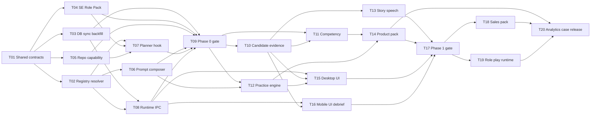

# OpenJob v1.0 通用面试 Agent 实施计划

> 状态：Draft for execution  
> 上位设计：[通用面试 Agent 插件化架构](./GENERAL_INTERVIEW_AGENT_ARCHITECTURE.md)  
> GitHub Feature：[v1.0 通用简历面试准备 Agent](https://github.com/ivanzwb/openjob/issues/2)  
> 目标：将架构拆成可以由多人并行开发、按独立 PR 交付的任务。

---

## 1. 文档职责

架构文档定义“为什么这样设计”和系统边界；本文定义“由谁先做什么、交付什么接口、谁依赖谁”。

本文中的任务编号 `T01`—`T20` 是稳定编号。GitHub Issue 编号可以变化，但任务编号不得复用。

---

## 2. v1.0 范围

### 2.1 必须交付

- 基础 Agent 与岗位包、能力插件的运行边界；
- `software-engineering`、`product-manager`、`sales-customer-success` 三个岗位包；
- `source-repository`、`role-play`、`analytics-case` 三个能力插件；
- CandidateEvidence、Competency、PracticeAttempt、Story 通用模型；
- 桌面端和手机端共享运行描述、岗位选择与降级行为；
- 手机端面后复盘；
- 旧软件工程 Campaign 无损迁移；
- Contract、Golden、迁移、同步、权限和跨端测试。

### 2.2 v1.0 后续

- `portfolio-review`；
- `presentation-review`；
- 外部可执行插件；
- 插件市场、签名分发与第三方 UI；
- 独立 Industry Pack 生态。

这些内容不阻塞 v1.0 发布。

---

## 3. 合并原则

1. 一个任务对应一个主要 PR；确需拆分时使用 `Txx-a`、`Txx-b`。
2. 公共接口只有一个 Owner。其他任务只能消费，不得复制或定义同义类型。
3. `src/shared` 先于桌面端和手机端实现。
4. 数据库变更必须同时覆盖桌面 migration、手机 migration bundle 和同步清单。
5. 旧枚举、旧表、旧 IPC 至少保留一个发布周期。
6. Phase Gate 未通过，不得开启下一阶段对 Core 的侵入式改造。
7. PR 不得夹带其他任务的 schema、shared type 或 migration。

---

## 4. 依赖图



### 4.1 可并行窗口

- T01 合并后：T02、T03、T04、T05 并行；
- T02/T03/T04/T05 分别稳定后：T06、T07、T08 并行；
- T09 通过后：T10、T11、T12 并行；
- 对应依赖满足后：T13、T14、T15、T16 并行；
- T17 通过后：T18、T19 并行；
- T20 最后执行集成与发布验收。

---

## 5. 公共接口所有权

### 5.1 T01 独占的类型

建议新增：

```text
src/shared/plugins/
├── types.ts
├── permissions.ts
├── contracts.ts
└── index.ts
```

T01 独占以下接口的命名与字段：

```ts
type PluginType = 'role-pack' | 'industry-pack' | 'capability';
type RuntimeAvailability = 'full' | 'view-only' | 'unsupported';
type InterviewProtocol =
  | 'knowledge'
  | 'behavioral'
  | 'case'
  | 'role-play'
  | 'work-sample'
  | 'presentation'
  | 'portfolio'
  | 'coding';

interface PluginManifest;
interface RolePack;
interface CompetencyTemplate;
interface InterviewFormatDefinition;
interface RubricDefinition;
interface PromptFragmentSet;
interface SourcePolicy;
interface CampaignRuntimeDescriptor;
interface ResolvedPluginRef;
type PluginPermission;
```

### 5.2 服务接口

```ts
interface RolePackRegistry {
  register(pack: RolePack): void;
  get(id: string, version?: string): RolePack | null;
  list(): RolePack[];
}

interface RuntimeResolver {
  resolve(input: ResolveRuntimeInput): ResolveRuntimeResult;
}

interface PermissionGateway {
  authorize(request: CapabilityRequest): PermissionDecision;
}

interface ModelGateway {
  complete(request: GroundedModelRequest): Promise<ValidatedModelResult>;
}

interface PlannerContribution {
  id: string;
  createTasks(context: PlannerContext): PlannedTask[];
}

interface EvidenceService {
  listConfirmed(scope: EvidenceScope): Promise<CandidateEvidence[]>;
  propose(input: EvidenceProposal): Promise<CandidateEvidence>;
  confirm(id: string): Promise<CandidateEvidence>;
}

interface PracticeProtocol {
  createSession(input: PracticeSessionInput): Promise<PracticeSession>;
  nextTurn(input: PracticeTurnInput): Promise<PracticeTurn>;
  evaluate(input: PracticeEvaluationInput): Promise<PracticeEvaluation>;
}

interface HostRenderedInteraction {
  type: string;
  schemaVersion: number;
  availability: Record<'desktop' | 'mobile', RuntimeAvailability>;
}
```

服务接口的实现任务如下：

- Registry/Resolver：T02；
- PermissionGateway：T05；
- ModelGateway 与 Prompt 组合：T06；
- PlannerContribution：T07；
- EvidenceService：T10；
- PracticeProtocol：T12；
- HostRenderedInteraction：T19。

---

## 6. 跨端与迁移约束

### 6.1 IPC

修改 `src/shared/ipc.ts` 时，同一 PR 必须同步更新：

- `src/main/ipc/index.ts`；
- `src/preload/index.ts`；
- `src/main/sync/rpc.ts` 中允许手机调用的 RPC；
- `src/shared/ipcContract.test.ts`。

### 6.2 数据库与同步

新增同步实体时，同一 PR 必须同步更新：

- `src/main/db/schema.ts`；
- `src/main/db/migrations/`；
- `mobile/src/db/migrations/` 与 `bundle.ts`；
- `src/main/sync/tables.ts`；
- 桌面和手机 FK/apply/migrate 测试。

下一条 migration 编号由 T03 唯一分配。其他任务不得创建 migration。

### 6.3 兼容模型

- `ExamForm` 与 `InterviewFormat.id` 双读；
- `KnowledgeNode` 与 `Competency` 双读；
- `QuizAttempt` / `DesignCase` 与 `PracticeAttempt` 双读；
- `TaskKind.readCode` 保留，由能力开关控制是否生成；
- `CompanyIntel.techStackMd` 保留，岗位包通过 `SourcePolicy` 提供通用视图。

### 6.4 Mobile

所有手机端实现必须遵守 Expo 57 文档。T03 必须同时修正 `mobile/app.json` 与根版本不一致的问题，否则精确版本同步会拒绝连接。

---

## 7. Phase 0：兼容外壳

### [T01 Shared plugin contracts](https://github.com/ivanzwb/openjob/issues/3)

**目标**

冻结所有下游使用的插件、岗位、题型、Rubric、权限和运行描述类型。

**Owned files**

- `src/shared/plugins/types.ts`
- `src/shared/plugins/permissions.ts`
- `src/shared/plugins/contracts.ts`
- `src/shared/plugins/index.ts`
- `src/shared/enums.ts`
- `src/shared/index.ts`

**Depends on**：无  
**Blocks**：T02—T08

**交付**

- 本文第 5 节公共类型；
- Manifest、SemVer、ID、权重、Rubric anchor、Prompt Slot 校验器；
- `CandidateEvidenceKind`，不得复用已有 citation `EvidenceKind`；
- 保留所有旧枚举值。

**验收**

- 非法 ID、重复 ID、错误权重、缺失 Rubric anchor 被拒绝；
- Role Pack 权限必须为空；
- 新类型可被桌面和手机 TypeScript 同时导入；
- Contract 单测通过。

**非目标**

- 不创建数据库表；
- 不实现 resolver；
- 不修改现有业务流程。

### [T02 Built-in registry and deterministic resolver](https://github.com/ivanzwb/openjob/issues/4)

**目标**

建立内置插件注册表和确定性 Runtime Resolver。

**Owned files**

- `src/shared/plugins/registry.ts`
- `src/shared/plugins/resolver.ts`
- `src/shared/plugins/resolver.test.ts`

**Depends on**：T01  
**Blocks**：T06、T07、T08

**Public interface**

```ts
resolve(input: {
  coreVersion: string;
  schemaVersion: number;
  rolePackId: string;
  industryPackId?: string;
  capabilityIds: string[];
  pinnedVersions?: Record<string, string>;
}): ResolveRuntimeResult;
```

`ResolveRuntimeResult` 返回客户端无关 descriptor 或结构化错误：

```ts
type RuntimeResolveErrorCode =
  | 'plugin-not-found'
  | 'version-conflict'
  | 'dependency-cycle'
  | 'core-incompatible'
  | 'schema-incompatible'
  | 'invalid-manifest';
```

**验收**

- 相同输入得到相同 descriptor/hash；
- 必需依赖失败时不产生部分 descriptor；
- 可选依赖失败时记录 `disabledReason`；
- 桌面和手机 fixture 解析 hash 一致。

### [T03 Persistence, sync and atomic backfill](https://github.com/ivanzwb/openjob/issues/5)

**目标**

为 RoleProfile、绑定和 Runtime Descriptor 建立双端持久化、同步和旧 Campaign 原子回填。

**Owned files**

- `src/main/db/schema.ts`
- `src/main/db/migrations/`
- `mobile/src/db/migrations/`
- `mobile/src/db/migrations/bundle.ts`
- `src/main/sync/tables.ts`
- `src/main/db/backfill/`
- `mobile/app.json`

**Depends on**：T01  
**Blocks**：T08、T09

**数据表**

- `role_profile`
- `campaign_plugin_binding`
- `campaign_runtime_descriptor`
- `migration_checkpoint`
- `campaign.role_profile_id`

**写入事务**

```text
RoleProfile
  + CampaignPluginBinding revision
  + CampaignRuntimeDescriptor
  + migration checkpoint
```

任一步失败整笔回滚，旧 Campaign 继续使用旧路径。

**验收**

- 桌面/手机从空库和旧库均可迁移；
- Backfill 可重复执行；
- 新表进入同步清单且 FK 顺序正确；
- 老版本手机写插件字段时得到明确升级错误；
- `mobile/app.json` 与根版本对齐。

### [T04 Software Engineering Role Pack adapter](https://github.com/ivanzwb/openjob/issues/6)

**目标**

把当前工程岗位行为登记为内置岗位包，但不重写现有实现。

**Owned files**

- `src/shared/plugins/builtin/softwareEngineering/`

**Depends on**：T01  
**Blocks**：T09

**Public interface**

```ts
export const softwareEngineeringRolePack: RolePack;
```

**交付**

- 旧 `ExamForm` 到稳定 format ID 的映射；
- 当前诊断、讲解、Quiz、Design Prompt registry key 映射；
- 工程能力模板、任务模板、Search SourcePolicy；
- Core 通用面试基线不放入该岗位包。

**验收**

- 现有工程 JD 的题型、Prompt 和计划行为不变；
- 岗位包通过 T01 contract；
- 不复制现有 Prompt 文本。

### [T05 Source repository capability and permission gateway](https://github.com/ivanzwb/openjob/issues/7)

**目标**

将源码能力登记为插件，并使所有源码工具调用经过权限网关。

**Owned files**

- `src/shared/plugins/builtin/sourceRepository/`
- `src/main/llm/toolPolicy.ts`
- `src/main/llm/tools.ts`
- `src/main/repo/tools.ts`
- `src/main/plugins/permissionGateway.ts`

**Depends on**：T01  
**Blocks**：T09

**Public interface**

```ts
authorize({
  campaignId,
  capabilityId,
  permission,
  resource
}): PermissionDecision;
```

**验收**

- 未启用插件或缺少 `repository:read` 时拒绝源码工具；
- 已启用工程 Campaign 的源码功能行为不变；
- 拒绝结果不泄露路径、文件或密钥；
- 原有 tool policy/repo answer tests 继续通过。

### [T06 Core Prompt composer and provenance](https://github.com/ivanzwb/openjob/issues/8)

**目标**

固定 Core Policy + Stage + Role Fragment + Evidence + User Request 的组合顺序。

**Owned files**

- `src/shared/prompts/composer.ts`
- `src/shared/prompts/registry.ts`
- `src/shared/prompts/grounding.ts`
- `src/main/llm/json.ts`
- `src/main/ab/promptRun.ts`

**Depends on**：T02  
**Blocks**：T09、T12

**Public interface**

```ts
composePrompt(input: PromptCompositionInput): ComposedPrompt;
```

`ComposedPrompt` 必须记录 coreVersion、rolePack/version、capability IDs、promptSlot、rubricId 和 evidence IDs。

**验收**

- Role Pack 不能提供完整 System Prompt；
- 无证据个人事实 fail closed；
- 工程岗位组合后的有效 Prompt 语义不变；
- Prompt run 可复现所用插件版本。

### [T07 Shared planner contribution](https://github.com/ivanzwb/openjob/issues/9)

**目标**

消除桌面和手机 `readCode` 排程逻辑复制，由共享 PlannerContribution 决定插件任务。

**Owned files**

- `src/shared/planner/contributions.ts`
- `src/main/plan/schedule.ts`
- `mobile/src/data/planLocal.ts`

**Depends on**：T02、T04、T05  
**Blocks**：T09

**Public interface**

```ts
collectPlannerContributions(
  runtime: CampaignRuntimeDescriptor,
  context: PlannerContext
): PlannedTask[];
```

**验收**

- 启用 source-repository 且 repo ready 时维持当前 readCode 节奏；
- 未启用时不生成 readCode；
- 不支持该任务的手机端显示“需桌面完成”；
- 两端相同输入产生相同插件任务。

### [T08 Runtime IPC and client capability view](https://github.com/ivanzwb/openjob/issues/10)

**目标**

向桌面和手机提供唯一 Runtime Descriptor 与本机降级视图。

**Owned files**

- `src/shared/ipc.ts`
- `src/main/ipc/index.ts`
- `src/preload/index.ts`
- `src/main/sync/rpc.ts`
- `src/shared/plugins/clientView.ts`

**Depends on**：T02、T03  
**Blocks**：T09、T15、T16

**Public operations**

- `plugin:listInstalled`
- `campaign:getRuntimeDescriptor`
- `campaign:setRoleProfile`
- `campaign:getClientCapabilityView`

**验收**

- 桌面和手机不各自解析插件依赖；
- 本机降级不修改 Campaign binding；
- IPC、preload、RPC whitelist 和 contract tests 同步；
- 未知 artifact schema 只读，不尝试解析。

### [T09 Phase 0 compatibility gate](https://github.com/ivanzwb/openjob/issues/11)

**目标**

证明插件外壳没有破坏现有软件工程流程。

**Owned files**

- `src/shared/plugins/__fixtures__/`
- `src/shared/plugins/*.test.ts`
- Phase 0 新增回归测试

**Depends on**：T03—T08  
**Blocks**：T10—T12

**验收**

- 旧 Campaign 无需重建；
- 工程 JD 仍生成 concept/coding/design/scenario；
- 有 ready repo 时仍生成 readCode；
- 禁用 source-repository 时没有源码工具和任务；
- 两端 descriptor hash 一致；
- 迁移、同步、IPC、权限和现有测试通过。

---

## 8. Phase 1：通用核心

### [T10 CandidateEvidence service](https://github.com/ivanzwb/openjob/issues/12)

**目标**

建立候选人事实的唯一可信来源。

**Owned files**

- `src/shared/evidence/`
- `src/main/evidence/`
- 对应 schema/entity 适配层

**Depends on**：T09  
**Blocks**：T13、T15、T16

**Public interface**

```ts
interface EvidenceService {
  extract(input: EvidenceExtractionInput): Promise<EvidenceProposal[]>;
  listConfirmed(scope: EvidenceScope): Promise<CandidateEvidence[]>;
  propose(input: EvidenceProposal): Promise<CandidateEvidence>;
  confirm(id: string): Promise<CandidateEvidence>;
  reject(id: string): Promise<void>;
}
```

**验收**

- Resume/JD/Company 来源严格区分；
- JD 内容不能成为 CandidateEvidence；
- 未确认 proposal 不进入个人化回答；
- 每条 Evidence 可定位原文。

### [T11 Competency diagnosis and priority](https://github.com/ivanzwb/openjob/issues/13)

**目标**

从 Role Pack 能力模板实例化 Campaign Competency，并映射证据、覆盖类型和优先级。

**Owned files**

- `src/shared/competency/`
- `src/main/diagnosis/`
- `src/shared/priority.ts`

**Depends on**：T09、T10  
**Blocks**：T14、T17

**Public interface**

```ts
diagnoseCompetencies(input: {
  rolePack: RolePack;
  jd: JdParsed;
  evidence: CandidateEvidence[];
}): Promise<CompetencyDiagnosis>;
```

**验收**

- 继续使用 deepDive/gap/landmine/extra；
- KnowledgeNode 保持可读；
- evidenceRisk 与 stageWeight 有确定计算和测试；
- 非工程岗位不产生工程能力污染。

### [T12 Generic Practice and Rubric engine](https://github.com/ivanzwb/openjob/issues/14)

**目标**

统一题目、追问、评分和复练协议，并兼容 QuizAttempt/DesignCase。

**Owned files**

- `src/shared/practice/`
- `src/main/practice/`
- `src/main/quiz/` 与 `src/main/design/` 适配层

**Depends on**：T06、T09  
**Blocks**：T14、T17

**Public interface**

```ts
interface PracticeProtocol {
  createSession(input: PracticeSessionInput): Promise<PracticeSession>;
  nextTurn(input: PracticeTurnInput): Promise<PracticeTurn>;
  evaluate(input: PracticeEvaluationInput): Promise<PracticeEvaluation>;
}
```

**验收**

- 每个分数能关联 Rubric anchor 与用户原回答；
- Quiz/Design 历史记录可转换为只读 PracticeAttempt；
- 旧 IPC 保持可用一个发布周期；
- mastery 回写路径唯一。

### [T13 Story and Speech integration](https://github.com/ivanzwb/openjob/issues/15)

**目标**

把真实经历组织为可复用 STAR/CAR Story，并与话术关联。

**Owned files**

- `src/shared/story/`
- `src/main/story/`
- SpeechSnippet source adapter

**Depends on**：T10  
**Blocks**：T17

**Public interface**

```ts
interface StoryService {
  create(input: StoryInput): Promise<Story>;
  revise(id: string, patch: StoryPatch): Promise<Story>;
  createDelivery(id: string, duration: 30 | 60 | 120): Promise<SpeechSnippet>;
}
```

**验收**

- Story 至少关联一个已确认 Evidence；
- 不同口述版本共享事实集合；
- 删除 Story 不删除 Evidence；
- Speech source 支持 `story`。

### [T14 Product Manager Role Pack](https://github.com/ivanzwb/openjob/issues/16)

**目标**

交付首个非工程岗位包，验证能力、案例、Rubric 和搜索策略可插拔。

**Owned files**

- `src/shared/plugins/builtin/productManager/`

**Depends on**：T11、T12  
**Blocks**：T17、T20

**交付**

- `pm.problem-framing`
- `pm.user-insight`
- `pm.metrics`
- `pm.prioritization`
- `pm.product-decision`
- case/behavioral/presentation formats；
- 对应 Rubric、Prompt fragment、SourcePolicy 和 Golden fixtures。

**验收**

- 不修改 Planner、Practice Engine、DB access；
- 不加载 coding、QPS、repo Prompt；
- 产品案例评分与工程设计评分维度显著不同；
- 无 analytics-case 时仍可完成纯文本案例。

### [T15 Desktop role, evidence and practice UI](https://github.com/ivanzwb/openjob/issues/17)

**目标**

桌面端提供岗位确认、能力插件状态、证据和通用练习入口。

**Owned files**

- `src/renderer/src/pages/CampaignDetail.tsx`
- `src/renderer/src/pages/DesignPractice.tsx`
- `src/renderer/src/App.tsx`
- 新增宿主 UI 组件

**Depends on**：T08、T10、T12  
**Blocks**：T17

**验收**

- 用户可确认岗位、级别和能力插件；
- Repos 导航仅在 capability 可用时显示；
- Evidence proposal 可确认/拒绝；
- UI 只消费 descriptor，不自行判断岗位字符串。

### [T16 Mobile role, resume attach and debrief UI](https://github.com/ivanzwb/openjob/issues/18)

**目标**

补齐手机端岗位确认、简历关联和面后复盘闭环。

**Owned files**

- `mobile/src/screens/CampaignsScreen.tsx`
- `mobile/src/data/diagnosisLocal.ts`
- `mobile/src/remote/rpc.ts`
- 新增 mobile debrief/evidence 组件

**Depends on**：T08、T10  
**Blocks**：T17

**验收**

- 支持文本/语音录入 selfDebrief；
- 生成 InterviewReport/Question 并可同步桌面；
- 支持关联简历或通过 RPC 交叉分析；
- 不支持的插件任务显示明确原因；
- 实现前核对 Expo 57 文档。

### [T17 Phase 1 cross-client and golden gate](https://github.com/ivanzwb/openjob/issues/19)

**目标**

验证通用核心和首个非工程岗位端到端可用。

**Owned files**

- Cross-client fixtures
- Product/Engineering Golden tests
- Debrief round-trip tests

**Depends on**：T13—T16  
**Blocks**：T18、T19

**验收**

- PM Campaign 完成诊断、计划、练习、评分和复盘；
- PM 不出现 coding/repo/QPS 污染；
- Mobile debrief 同步后能更新桌面盲区；
- 工程 Campaign 无回归；
- Evidence grounding 失败时不保存答案。

---

## 9. Phase 2/3：扩展验证与发布

### [T18 Sales and Customer Success Role Pack](https://github.com/ivanzwb/openjob/issues/20)

**目标**

交付销售/客户成功岗位能力模型，为角色扮演提供岗位协议。

**Owned files**

- `src/shared/plugins/builtin/salesCustomerSuccess/`

**Depends on**：T17  
**Blocks**：T20

**交付**

- discovery、value articulation、objection handling、negotiation、pipeline；
- behavioral 和 role-play formats；
- 倾听、澄清、应变、推进 Rubric；
- 行业中立 SourcePolicy 和 Golden fixtures。

**验收**

- 不修改 Core Practice；
- 无 role-play 插件时可降级为文本行为题；
- 评分不使用技术准确性/QPS 等工程维度。

### [T19 Host-rendered interaction and role-play capability](https://github.com/ivanzwb/openjob/issues/21)

**目标**

实现宿主渲染的可扩展交互协议及首个 role-play 能力插件。

**Owned files**

- `src/shared/plugins/interactions/`
- `src/main/plugins/interactionRuntime.ts`
- 桌面/手机 Host renderer
- `src/shared/plugins/builtin/rolePlay/`

**Depends on**：T17  
**Blocks**：T20

**Public interface**

```ts
interface HostRenderedInteraction {
  type: string;
  schemaVersion: number;
  availability: Record<'desktop' | 'mobile', RuntimeAvailability>;
  inputSchema: JsonSchema;
  resultSchema: JsonSchema;
}
```

**验收**

- 插件不注入任意 React 组件；
- 超时、取消、崩溃和权限撤销不破坏 Campaign；
- 角色状态可恢复；
- 两端对同一 interaction schema 有一致降级行为。

### [T20 Analytics case and v1.0 integration gate](https://github.com/ivanzwb/openjob/issues/22)

**目标**

交付 analytics-case 能力，并完成 v1.0 全链路集成和发布验收。

**Owned files**

- `src/shared/plugins/builtin/analyticsCase/`
- 集成测试与发布文档
- v1.0 migration/sync fixture

**Depends on**：T14、T18、T19  
**Blocks**：v1.0 release

**交付**

- CSV/XLSX artifact contract；
- 数据概览、指标分析、假设、建议和风险输出；
- Product Manager 可选启用；
- v1.0 Upgrade/rollback 文档。

**验收**

- 工程、产品、销售三个岗位包通过 Golden tests；
- source-repository、role-play、analytics-case 权限隔离通过；
- 桌面/手机 migration、sync、descriptor 和 debrief E2E 通过；
- 旧 Campaign 可继续使用；
- README、用户手册、架构和实施状态同步；
- 未完成的 portfolio/presentation 明确留在 backlog，不阻塞发布。

---

## 10. Issue 模板

每个 GitHub Issue 使用以下结构：

```md
## 目标

## Depends on
- #issue

## Blocks
- #issue

## Owned files

## Public interfaces

## 功能范围

## 验收标准
- [ ] ...

## Out of scope

## PR 约束
- 一个主要 PR
- 不夹带其他任务的 shared/schema/migration
```

---

## 11. Phase Gate

### Phase 0 Done

- T01—T08 全部完成；
- T09 测试通过；
- 工程功能与旧 Campaign 无回归；
- shared contract 和第一条 migration 冻结。

### Phase 1 Done

- T10—T16 全部完成；
- T17 测试通过；
- Product Manager 跨端闭环可用；
- 手机面后复盘完成。

### v1.0 Done

- T18—T20 全部完成；
- 三个岗位包、三个能力插件通过验收；
- 迁移、回滚、权限和同步验证通过；
- 无 P0/P1 已知缺陷；
- Feature #2 的所有阻塞任务关闭。
