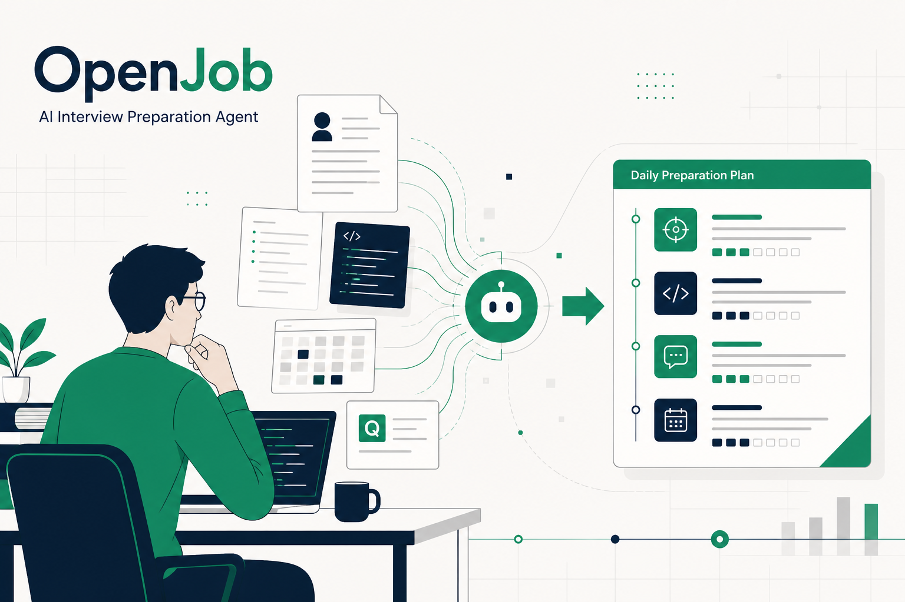
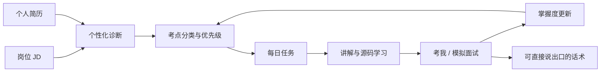
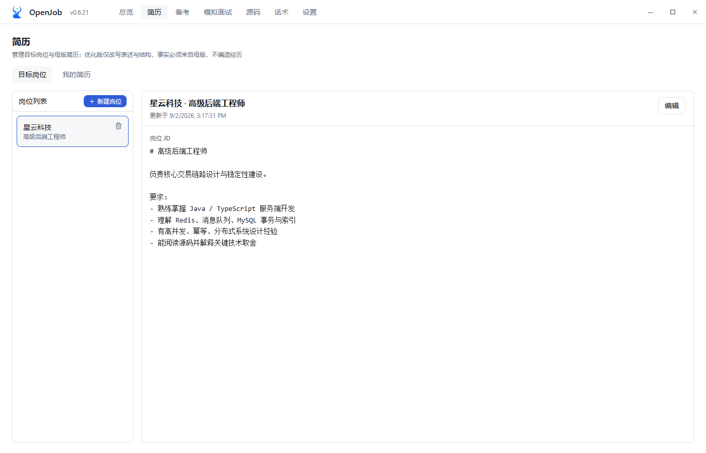
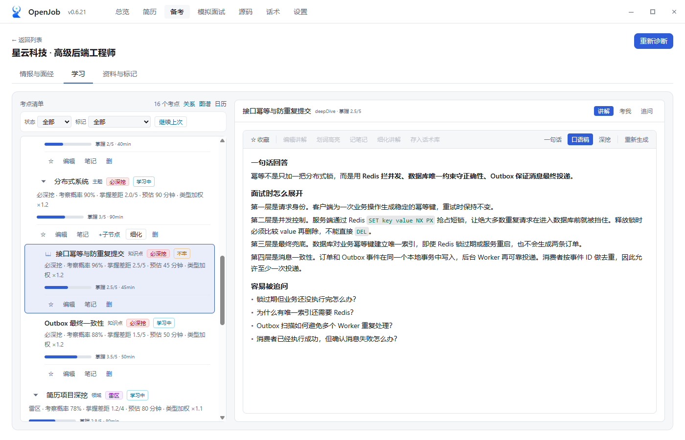
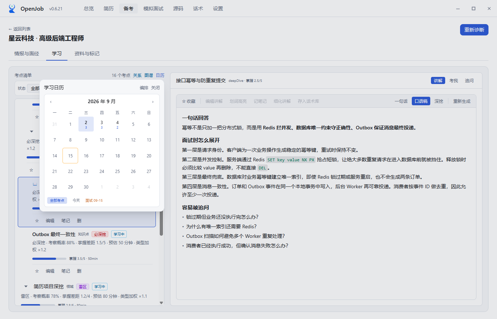
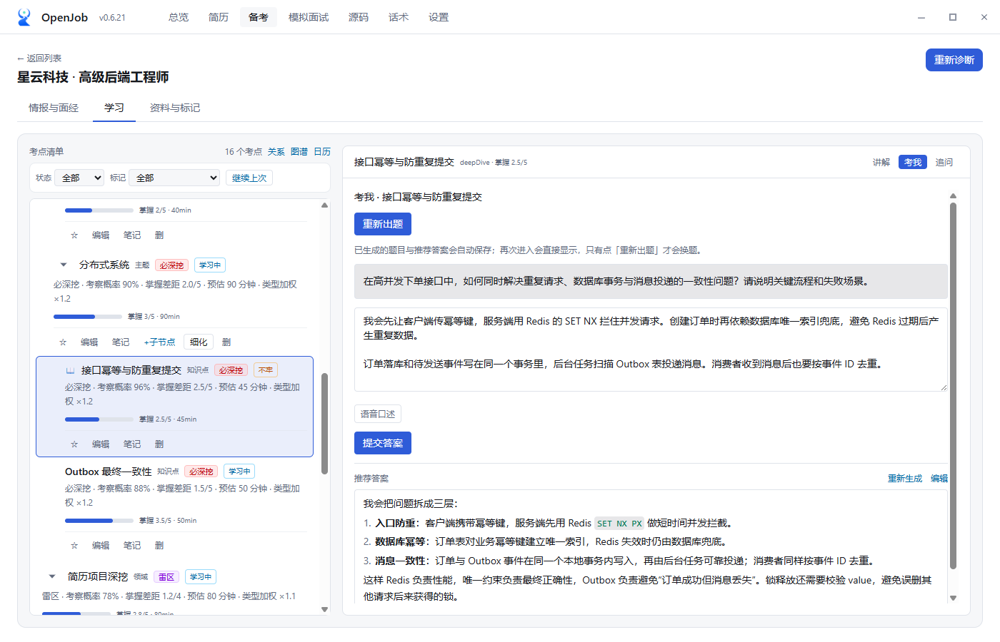
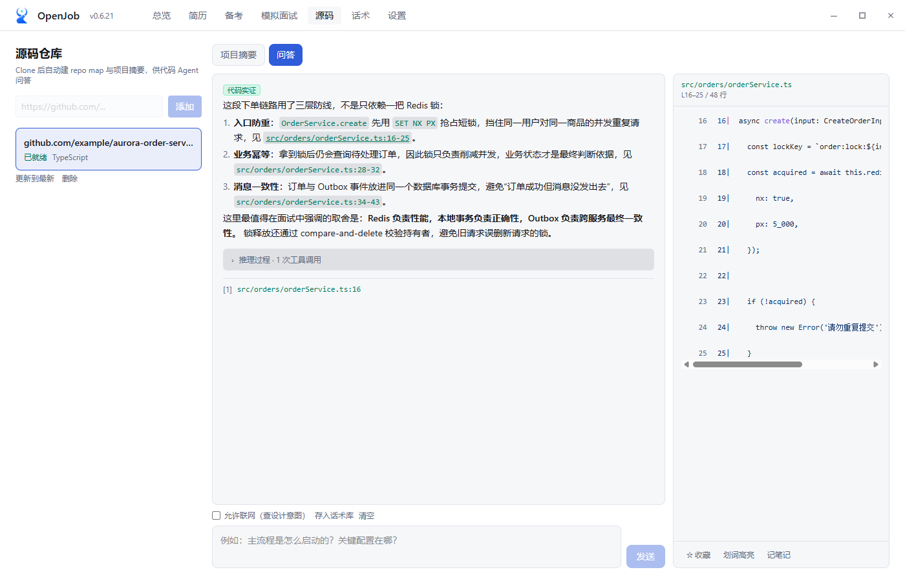
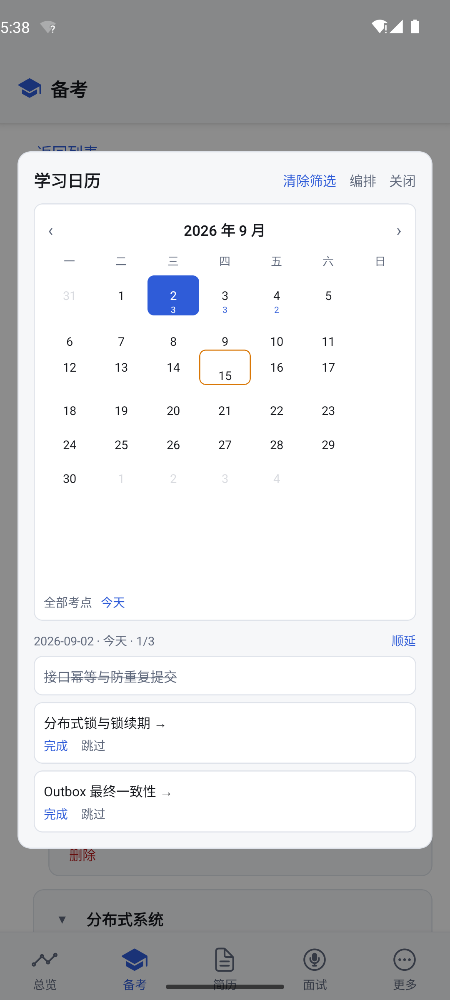

# 别再收藏第 100 份面试题了：真正缺的是一套备考系统

面试前，你可能经历过这样的晚上：

- 浏览器里开着十几个面经页面；
- 收藏夹里躺着几百道题；
- JD 上每个词都像“可能会问”；
- 简历里写过的技术，自己反而最怕被追问；
- 明明很焦虑，却不知道今晚这两个小时应该先看什么。

很多人以为这是“资料不够”的问题，于是继续搜题、收藏、问大模型。

但资料越多，行动反而越难。

**真正稀缺的不是答案，而是取舍：针对这一次面试，我最可能被问什么？哪些内容必须深挖？哪些短板只需要准备一个不露怯的框架？今天到底该完成什么？**

这就是我做 OpenJob 的原因。

## OpenJob 是什么？

OpenJob 是一个以“一场具体面试”为单位的备考 Agent。

**你给它岗位 JD、个人简历、面试日期和每天可投入的时间，它会找出最该准备的考点，并排成每天可以完成的任务。**

它把零散信息组织成一套可执行的备考流程：

它不是把“知识图谱、题库、笔记、源码问答”并排放在一起，等你自己决定怎么用。

它更像一个备考教练：先诊断，再规划，然后每天告诉你下一步做什么，并根据你的实际回答继续调整。

*不是泛泛学习，而是先为一场具体面试建立目标岗位。图中公司、岗位和内容均为虚构演示数据。*

## 第一层：不是“这个岗位会问什么”，而是“你会被问什么”

只分析 JD，只能得到一份通用技能清单。

OpenJob 会把 JD 和你的简历交叉分析，把考点分成四类：

### 1. 必深挖

简历写了，JD 也要求。

这是面试官最容易连续追问的部分。你不能只会背定义，还要能讲实现原理、技术取舍、踩过的坑，以及为什么当时这么设计。

### 2. 短板

JD 要求，但简历里没有。

短时间内不一定能补成专家，但至少可以建立答题框架：知道核心概念、适用场景、学习路径，并坦诚说明实践深度。

### 3. 雷区

简历写了，但 JD 没有重点强调。

很多人会忽略这部分，可面试官手里拿的是你的简历。只要顺嘴追问一句，写过却讲不清楚，杀伤力往往比“没学过”更大。

### 4. 加分项

JD 和简历都没有直接要求，但与岗位方向相关。

有余力再准备，不让低收益内容挤占核心考点时间。

这套分类解决了一个很现实的问题：**备考不是把所有知识学完，而是在有限时间内，把最容易影响结果的地方准备好。**

*同一个技术点，对不同候选人的准备优先级完全不同。左侧是考点分类和掌握度，右侧是可继续细化的讲解。*

## 第二层：计划不是排满，而是帮你做取舍

如果距离面试还有两周，每天只能投入两小时，总共只有 28 小时。

而一份完整的考点树，可能需要 60 小时甚至更多。

普通计划工具会把任务铺满日历；OpenJob 更关心的是：**有限时间应该花在哪里。**

它会综合考虑：

- JD 中的权重；
- 简历匹配程度；
- 考点难度与预计耗时；
- 当前掌握度；
- 前置知识关系；
- 真实面经和复盘信息。

然后生成每日任务，混合安排新学、复习、口述练习、源码阅读和兜底话术。

今天没时间，也可以顺延，而不是让整个计划从第一天开始失真。

*面试日期、每日可用时间和任务进度被放进同一个学习日历。*

## 第三层：从“看懂”走到“能说出口”

面试不是开卷考试。

你可能看懂了一篇长文，也能理解某段源码，但真正坐到面试官面前时，仍然可能组织不出两分钟的完整回答。

因此 OpenJob 把所有学习链路的终点统一成一件事：

**面试时能说出口的话。**

知识点讲解支持不同深度：快速建立概念、标准面试回答、继续深挖实现与取舍。你可以选中讲解片段做高亮、写笔记、继续细化，也可以沉淀成自己的话术。

“考我”不是附属题库，而是掌握度传感器：

1. Agent 围绕当前知识点出题；
2. 你用文字或语音作答；
3. 系统给出评分、遗漏点和改进建议；
4. 改进后的回答可以继续编辑，变成自己的表达；
5. 分数回写掌握度，影响后续任务安排。

这形成了一个闭环：不是“看完就算学会”，而是通过输出检验理解，再让计划根据结果变化。

*题目、回答草稿和推荐答案会按考点保存，方便反复口述和修改。*

## 第四层：源码问答必须回到源码

对于开发岗位，很多高质量回答来自源码。

“我知道 Redis 用了跳表”和“我看过它为什么这样组织、关键实现在哪、有什么取舍”，在面试里的说服力完全不同。

OpenJob 桌面端可以克隆并索引代码仓库，源码 Agent 通过目录查找、文件名搜索、符号定位、内容搜索和文件读取来完成分析。回答中的代码结论使用 `file:line` 形式引用，方便你直接回到原文件核对，而不是把模型生成的内容当事实背下来。

源码阅读的终点也不是“看过了”，而是沉淀成可用于面试的素材：

- 一个值得讲的实现细节；
- 一项设计取舍；
- 一个你认同或不认同的决定；
- 一段能体现技术深度的口语化表达。

*源码 Agent 先调用工具读取文件，再生成回答；点击 `path:line` 引用可在右侧核对原始代码。图中仓库为本地虚构演示仓库。*

## 第五层：桌面负责完整能力，手机负责随时推进

OpenJob 有 Electron 桌面端和 Expo 手机端。

桌面端负责完整诊断、规划、仓库克隆与索引；手机通过局域网扫码配对同步后，可以离线浏览和继续学习。

同步的不只是几条笔记，还包括备考数据、讲解、题目、计划以及源码快照。完成同步后，手机不需要保持电脑在线；浏览已同步内容可以离线，调用云端 LLM 时仍然需要网络。

这意味着通勤时可以复习，走路时可以口述练习，临睡前可以完成当天最后一道题，而不是只有坐到电脑前才算“开始备考”。

  

*桌面端生成的同一套虚构演示计划已写入手机端：日期、考点和完成状态保持一致，离开电脑也能继续推进。*

## 它和直接问大模型有什么不同？

直接问大模型当然有用，但大多数对话是一次性的：

你问一道题，它给一个答案；你关掉窗口，这个答案通常不会改变明天的学习安排，也不知道它和你的 JD、简历、面试日期有什么关系。

OpenJob 的价值不在于“又接入了一个模型”，而在于把模型放进一个持续运行的流程里：

- JD 和简历决定考点；
- 面试日期决定取舍；
- 讲解和源码帮助学习；
- 作答结果修正掌握度；
- 掌握度影响后续计划；
- 最终内容沉淀成话术；
- 面试后的真题再反哺下一次准备。

模型负责理解和生成，系统负责上下文、事实来源、优先级和闭环。

## 谁适合使用 OpenJob？

它更适合这些人：

- 距离面试只剩几天或几周，需要迅速做取舍；
- 收藏了大量资料，但每天不知道从哪里开始；
- 简历技术点很多，担心被深挖；
- 需要准备开发、架构、数据、算法等技术岗位；
- 想通过口述和模拟面试训练输出，而不只是继续阅读；
- 希望在桌面和手机之间延续同一套备考进度。

如果你只是想临时查一个定义，通用大模型更快；如果你需要的是一份固定题库，搜索引擎也足够。

OpenJob 要解决的是另一件事：**让一次真实面试的准备，从“到处搜资料”变成“每天完成最重要的几件事”。**

## 最后

做这个工具时，我一直在提醒自己：

求职者真正缺少的，不是第 101 份面试题。

而是有人把 JD、简历、时间、源码、练习结果放在一起，告诉他：

**这次面试，你最应该准备什么；今天，你先做哪一件。**

这就是 OpenJob。

项目采用 Apache License 2.0 开源。如果你正在准备面试，欢迎试用，也欢迎把真实使用中的问题、建议和面试复盘反馈回来。

> 项目地址：**https://github.com/ivanzwb/openjob**
> 下载地址：**https://github.com/ivanzwb/openjob/releases**

---

## 发布前编辑清单（不随正文发布）

1. 桌面端与手机端截图均来自隔离的虚构演示数据，已复核未显示 API Key、本地路径或调试信息。
2. 如果 Windows 安装包尚未签名，在下载页说明 SmartScreen 操作，不建议放在正文主卖点附近。
3. 不宣传“保证拿 offer”“自动通过面试”等不可验证结果。
