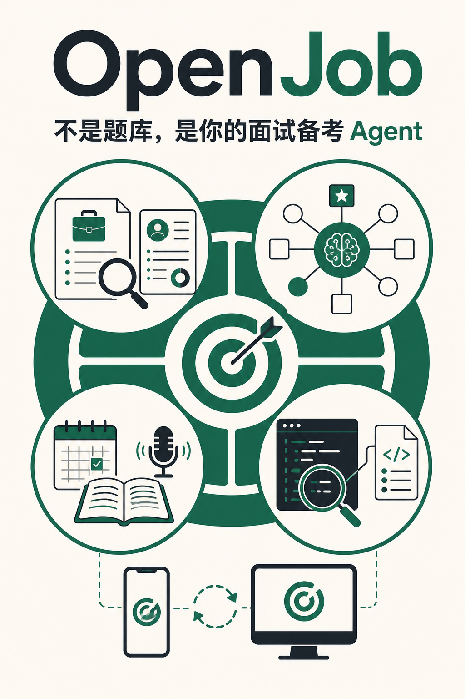
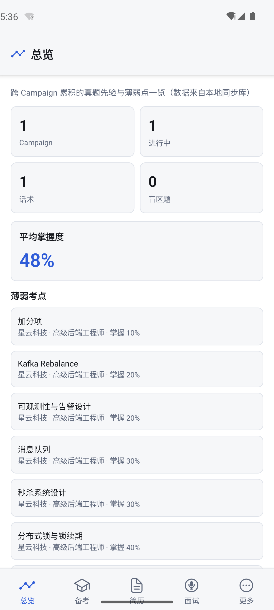

# 面试时，知识点记不住，思路理不清，怎么办，你需要的是面试备考 Agent

## 正文

面试前最难的，往往不是找不到资料。

而是：

- JD 上这么多技术，到底先看哪个？
- 简历里写过的项目，哪些最容易被追问？
- 收藏了一堆面试题，今天到底练什么？
- 看懂了知识和源码，真到面试时为什么还是说不出来？

所以我做了 **OpenJob**。

它不是再给你一套固定题库，而是围绕一场具体面试，把备考真正串起来：

**JD × 简历诊断**  
找出必深挖、短板、简历雷区和加分项，不再平均用力。

**每日任务规划**  
根据面试日期、可用时间和掌握度，告诉你今天最值得做什么。

**讲解 + 考我 + 模拟面试**  
不只让你“看懂”，还要通过文字或语音练到“能说出口”。

**源码 Agent**  
查文件、找符号、读源码，代码结论用 `file:line` 引用，方便直接核对。

**桌面 + 手机同步**  
桌面做诊断和源码索引，手机同步后无需保持电脑在线，可以继续复习、答题和口述练习。

OpenJob 想解决的不是“答案在哪里”，而是：

> **这次面试，我最应该准备什么？今天先做哪一件？**

项目开源，采用 Apache License 2.0。

项目地址：**https://github.com/ivanzwb/openjob**  
下载地址：**https://github.com/ivanzwb/openjob/releases**

  

  

